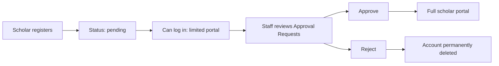
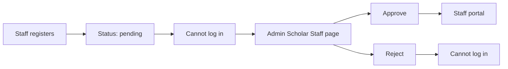
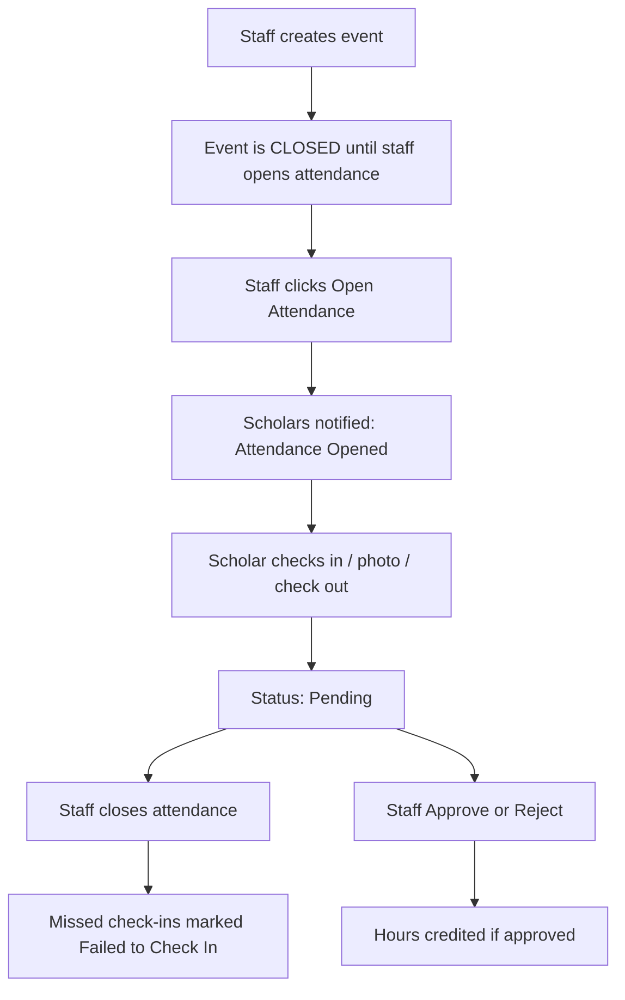

# Batang Surigaonon Scholar's App (BSSA)

A Laravel web application for managing the **Batang Surigaonon scholarship program**. It connects **scholars**, **scholar staff**, and **system administrators** around events, attendance, service hours, documents, approvals, and location-scoped scholarship programs (city vs province).

This README describes the **current codebase** in this repository. It is written from the routes, controllers, models, migrations, seeders, views, and configuration files that exist today.

---

## Table of contents

1. [Project overview](#1-project-overview)
2. [What problem it solves](#2-what-problem-it-solves)
3. [User roles and permissions](#3-user-roles-and-permissions)
4. [System workflows](#4-system-workflows)
5. [Authentication and authorization](#5-authentication-and-authorization)
6. [Features by portal](#6-features-by-portal)
7. [Notifications](#7-notifications)
8. [Backend architecture](#8-backend-architecture)
9. [Frontend architecture](#9-frontend-architecture)
10. [Database](#10-database)
11. [Routes](#11-routes)
12. [Project structure](#12-project-structure)
13. [Technologies, languages, and packages](#13-technologies-languages-and-packages)
14. [System requirements](#14-system-requirements)
15. [Installation and setup](#15-installation-and-setup)
16. [Environment configuration](#16-environment-configuration)
17. [Database setup](#17-database-setup)
18. [How to run the application](#18-how-to-run-the-application)
19. [Build and production notes](#19-build-and-production-notes)
20. [Seeded administrator account](#20-seeded-administrator-account)
21. [Security features](#21-security-features)
22. [Validation and error handling](#22-validation-and-error-handling)
23. [Troubleshooting](#23-troubleshooting)
24. [Development guide](#24-development-guide)

---

## 1. Project overview

**Name in the UI:** Batang Surigaonon Scholar's App  
**Code location:** this Laravel application (`composer.json` name is `laravel/laravel`; the product logic lives under `app/`, `resources/views/`, and `database/`).

The system is a **role-based scholar portal** with three portals:

| Portal | URL prefix | Who uses it |
|--------|------------|-------------|
| Scholar (user) | `/user` | Approved and pending scholars |
| Scholar Staff | `/staff` | Approved scholar staff assigned to a scholarship program |
| Administrator | `/admin` | System administrators |

The root URL `/` redirects to the login page. After login, users are sent to the dashboard that matches their role.

City Scholarship Programs and Province Scholarship Programs are stored as separate `scholarship_programs` rows and are **not mixed** in staff or admin queries. Each program has its own scholars, staff, events, and documents.

---

## 2. What problem it solves

The application supports day-to-day scholarship operations:

- Register scholars and scholar staff against a **specific city or province program**.
- Approve or reject new accounts before they get full access.
- Publish **events**, collect **participation**, and control **attendance sessions** (open/close).
- Collect **check-in / check-out** and a **participation photo**.
- Credit **service hours** after staff approval.
- Require and review **documents** by program-specific document types.
- Track **academic year / semester** for hours and reports.
- Give administrators a **system-wide view** filtered by location and program.

---

## 3. User roles and permissions

Roles are stored on `users.role` (`App\Models\User`):

| Constant | Value | Meaning |
|----------|--------|---------|
| `ROLE_SCHOLAR` | `scholar` | Scholar / regular user |
| `ROLE_SCHOLAR_STAFF` | `scholar_staff` | Scholar staff |
| `ROLE_ADMIN` | `admin` | Administrator |

`users.is_admin` is also used; `User::isAdmin()` is true when `is_admin` is true **or** `role` is `admin`.

Account status (`users.status`):

| Constant | Value | Typical use |
|----------|--------|-------------|
| `STATUS_PENDING` | `pending` | Waiting for approval |
| `STATUS_APPROVED` | `approved` | Active |
| `STATUS_REJECTED` | `rejected` | Denied |

### 3.1 Scholar

- **Can log in** unless status is `rejected`.
- **Pending scholars** can open Dashboard, Announcements, and Logout. Events, Calendar, Service Hours, Documents, Notifications, and Profile are blocked until staff approval (`EnsureScholarApproved` and sidebar restrictions).
- **Approved scholars** get the full scholar portal.
- Scholars can only see events and content for their assigned `scholarship_program_id`.
- Scholars **cannot edit or delete** submitted attendance records. They can check in, check out, and upload a photo **only while staff have opened attendance** for that event.
- Attendance status shown to scholars: **Pending**, **Approved**, **Rejected** (and failed check-in when applied).

### 3.2 Scholar staff

- Registration starts as **pending**. Pending and rejected staff **cannot log in** to the staff portal (`EnsureScholarStaff`, `AuthController::login`).
- **Only administrators** see pending staff registrations and can Approve or Reject them.
- Pending staff **do not appear** in “All Scholar Staff Accounts” and are not counted as active staff.
- After approval, staff can manage **only their assigned program** (`managedLocationIds()` / `coveredLocationIds()`, which is that program’s own ID).
- Staff can approve/reject **scholars**, create events, open/close attendance, approve/reject attendance hours, manage document types and reviews, and run reports for their program.
- Staff **cannot** approve other staff accounts.

### 3.3 Administrator

- Full `/admin` portal (`EnsureAdmin`).
- Can filter almost every admin page by **program type** (all / city / province) and **specific program**.
- Approves or rejects **scholar staff** only (not scholar accounts — those are staff’s job).
- Can view scholars, events, attendance, hours, documents, participation, and reports in the selected scope.
- Can manage location/program records (display name, active flag) and add locations.
- Can update their own name, email, and password.

---

## 4. System workflows

### 4.1 Scholar registration and approval



1. Scholar submits `/register` with name, scholar ID, email, password, program (city/province tree), and optional school/contact fields.
2. `User::register()` creates the account; `AccountService::provisionNewAccount()` creates document placeholders and a pending-approval notification.
3. Staff on the same program see the scholar under **Approval Requests** and **Scholars**.
4. **Approve** sets status to `approved` and notifies the scholar.
5. **Reject** permanently deletes the scholar account (`AccountService::permanentlyDelete`).

### 4.2 Scholar staff registration and approval



1. Staff submits `/register/staff`.
2. Account is `scholar_staff` + `pending`. Admin is notified only via the admin **Scholar Staff** pending list and sidebar badge.
3. Other staff never see pending staff details.
4. Admin **Approve** sets `approved`. Admin **Reject** sets `rejected` (account remains; login is blocked).

### 4.3 Event, attendance, and service hours



- New events default to **attendance closed**. Event schedule times do **not** auto-open attendance.
- Staff **Open Attendance** / **Close Attendance** write timestamps, actor IDs, and `attendance_session_logs`, and notify scholars.
- While open, scholars may submit attendance. While closed, they cannot submit or change it.
- Staff approve or reject hours. Scholars see **Pending / Approved / Rejected**. Staff no longer have a free-form “Edit Attendance Record” form.
- Live status for scholars: `GET /user/attendance-status` polled about every 5 seconds (`resources/js/user-app.js`).

### 4.4 Documents

1. Staff define **document types** per scholarship program.
2. When a scholar is provisioned, placeholder `documents` rows are created (`ScholarService::ensureUserDocuments`).
3. Scholar uploads a file (stored on the `public` disk).
4. Staff review: approve, reject, or other status updates, with optional notes.

---

## 5. Authentication and authorization

### Login (`AuthController`)

- Email + password; email is lowercased.
- Remember-me duration is set to **10 years** (5,256,000 minutes) in `AppServiceProvider` so inactivity does not expire the account.
- After success, `last_login_at` is updated (`User::markLogin`).
- Redirect: admin → admin dashboard; approved staff → staff dashboard; scholar → user dashboard.
- Pending scholars see a pending-approval modal (session flag `show_pending_approval_modal`).

### Who can log in (`User::canLogin`)

- Admin: always (if credentials match).
- Scholar staff: only `approved`.
- Scholar: any status except `rejected`.

### Registration

- Scholar: unique email and scholar ID; password min 8 characters, confirmed.
- Staff: unique email/scholar ID rules in `assertStaffRegistrationIsUnique`; same password rules; status `pending`.
- Rate limits: login **5** attempts / 60s window; scholar register **3** / 60s; staff register **3** / 60s.

### Middleware aliases (`bootstrap/app.php`)

| Alias | Class | Effect |
|-------|--------|--------|
| `admin` | `EnsureAdmin` | 403 unless administrator |
| `scholar` | `EnsureScholar` | Scholar portal; rejected/staff-rejected users logged out |
| `scholar.approved` | `EnsureScholarApproved` | Pending scholars redirected to user dashboard |
| `scholar.staff` | `EnsureScholarStaff` | Staff portal; pending/rejected staff logged out |
| `scholar.staff.approved` | `EnsureScholarStaffApproved` | Staff feature routes require approved staff |

### Route-model binding (`AppServiceProvider`)

- `{staffMember}` resolves only `scholar_staff` users and **only for administrators** (others get 404).
- `{scholar}` resolves only `role = scholar` (staff cannot open a staff user via scholar URLs).

---

## 6. Features by portal

### 6.1 Public / auth pages

| Page | Route | Function |
|------|--------|----------|
| Login | `GET/POST /login` | Sign in |
| Scholar register | `GET/POST /register` | Create scholar account |
| Staff register | `GET/POST /register/staff` | Create pending staff account |
| Logout | `POST /logout` | End session |
| Event image | `GET /events/{event}/image` | Serve stored event image (auth required) |

### 6.2 Scholar portal (`/user`)

| Section | What it does |
|---------|----------------|
| **Dashboard** | Welcome, hour stats, upcoming events, pending attendances, announcements, recent activity, attendance OPEN/CLOSED cards, sidebar hour/calendar widgets |
| **Events** | List/select events; register; check in/out; upload photo when session is open; see attendance status badges |
| **Attendance live status** | JSON poll for open/closed sessions and unread notification count |
| **Calendar** | Month calendar of program events |
| **Service hours** | Approved/pending/remaining hours; filter by academic year and semester |
| **Documents** | Upload required documents; see approved/pending/rejected/not submitted |
| **Notifications** | All / Unread / Important; mark one or all read; settings toggles; show 5 latest then **See More** / **Show Less** |
| **Announcements** | List and read announcements; mark read |
| **Profile & Settings** | Personal info, guardian, academic year/semester preference; change password; delete account (password required). Login email, scholar ID, and password are not editable on the account tab |
| **Pending modal** | Explains that staff must approve the account |

Global academic year/semester can be updated from the scholar profile **only by an administrator** (`ProfileActionController::updateGlobalAcademicSettings`).

### 6.3 Scholar staff portal (`/staff`)

| Section | What it does |
|---------|----------------|
| **Dashboard** | Program stats: scholars, events, pending attendance, hours, documents, pending approvals, recent activity, upcoming events |
| **Scholars** | List scholars in the assigned program; open a scholar profile |
| **Scholar detail** | Account overview for one scholar the staff member can manage |
| **Approval Requests** | Pending scholar registrations; Approve or Reject |
| **Events** | List events; **Create Event** (title, schedule, hours, venue, JPG/PNG upload up to 5MB); event detail |
| **Attendance** | Per-event lists: checked in vs failed to check in; **Open / Close Attendance** with confirm modal; Approve / Reject hours; view photos. No edit-record form |
| **Documents** | CRUD document types; review uploaded files (view/download/status) |
| **Calendar** | Staff calendar of program events |
| **Reports** | Service hours, attendance, participation, completion |
| **Settings** | Read-only general/notification display; **Change Password** modal (current + new + confirm; hashed via `User::updatePassword`) |

### 6.4 Admin portal (`/admin`)

| Section | What it does |
|---------|----------------|
| **Dashboard** | Scope banner + **Location & Scholarship Program** dropdown (All Locations / All Programs, or a specific city/province program). Stats are queried for that scope only: scholars (total/approved/pending/rejected), approved staff, pending staff, events, attendance, service hours, documents, participation, completed scholars. Location Comparison UI has been removed from this page |
| **Locations** | City vs province program lists; add/edit location (display name, active) |
| **Scholars** | Read-only list in current scope |
| **Scholar Staff** | Pending registrations (Approve/Reject) visible only here; All Scholar Staff Accounts shows approved/rejected, not pending |
| **Events / Attendance / Service Hours / Documents / Participation** | Scoped monitoring |
| **Reports** | Combined stats and location summaries for the current filter |
| **Admin Settings** | Update admin name/email; change password |
| **Sidebar badge** | Polls `GET /admin/sidebar-badges` for pending staff count |

Admin scope is stored in session: `admin_location`, `admin_program_type`. Queries use `AdminDashboardService::resolveAdminProgramIds()`.

---

## 7. Notifications

In-app notifications use table `scholar_notifications` (`ScholarNotification`).

Typical categories used in the UI: `event_reminder`, `attendance`, `service_hours`, `documents`, `reminder`, `announcement`, `system`.

Examples of what the app writes today:

- Account pending / approved / welcome
- Staff account pending / approved / rejected
- Event published / confirmed
- Attendance opened / closed
- Participation / hours / photo / verification outcomes
- Password changed (scholar)

Scholar notification preferences (JSON on the user): event reminders, attendance updates, service hours, document updates, announcements.

Unread count: `User::unreadNotificationCount()` (`is_read = false`). Shown as a red circle badge on the scholar **Notifications** nav item (hidden at 0; `99+` over 99). Live poll updates the badge.

The Notifications page loads **5** newest items first. Extra rows are in the page but hidden. **See More Notifications** / **Show Less Notifications** toggle them in the browser without deleting records.

Staff settings “Email Notifications” / “System Alerts” toggles on the staff Settings page are **display-only** (not wired to a save action).

There is **no separate email-sending implementation** in application code; `MAIL_MAILER` in `.env.example` defaults to `log`.

Flash messages use `partials/flash-messages.blade.php` (`success`, `error`, validation `$errors`).

---

## 8. Backend architecture

Laravel 12 MVC. There is **no** `routes/api.php` public API. A few JSON responses support the UI.

### Controllers

| Controller | Responsibility |
|------------|----------------|
| `AuthController` | Login, register scholar/staff, logout, rate limits |
| `UserController` | Scholar pages + attendance status JSON + notification pages |
| `StaffController` | Staff pages, scholar approve/reject, attendance open/close/approve/reject, password change |
| `StaffDocumentController` | Document types and file review |
| `AdminController` | Admin pages, staff approve/reject, location CRUD, admin password |
| `EventActionController` | Scholar event register, check-in/out, photo, event image |
| `DocumentActionController` | Scholar upload/download |
| `NotificationActionController` | Mark read, settings |
| `AnnouncementActionController` | Mark announcements read |
| `ProfileActionController` | Profile, password, delete account, academic settings |

### Services

| Service | Responsibility |
|---------|----------------|
| `ScholarService` | Hours, documents, calendar, notifications, missed check-ins, activity log |
| `StaffDashboardService` | Staff/admin stats and reports scoped by program IDs |
| `AdminDashboardService` | Admin scope, staff queries, dashboard stats |
| `AttendanceSessionService` | Open/close attendance, notify scholars, live status payload |
| `AccountService` | Provision new scholar/staff; permanent delete |
| `AnnouncementService` | Announcements for a user |
| `AcademicSettingsService` | Global and per-user academic year/semester; `1st Semester` / `2nd Semester` |
| `ProgramScopeService` | Program-type totals |
| `ScholarshipProgramAssignmentService` | Resolve city/province assignment on register |
| `ScholarshipProgramImportService` | Import programs from `database/data/psgc-locations.json` |

### Models

`User`, `ScholarshipProgram`, `Event`, `EventRegistration`, `Attendance`, `AttendanceSessionLog`, `Document`, `DocumentType`, `Announcement`, `AnnouncementRead`, `ScholarNotification`, `UserActivity`, `AcademicSetting`.

Passwords use the Eloquent `hashed` cast. `User::updatePassword()` and `User::register()` set the password through that cast (not mass assignment of `password`).

---

## 9. Frontend architecture

- **Blade** templates under `resources/views/` (`layouts/app.blade.php`, `user`, `staff`, `admin`, `auth`).
- **Vite** bundles `resources/css/styles.css`, `resources/css/app.css`, `resources/js/app.js`, `resources/js/user-app.js`.
- **Tailwind CSS v4** is in the Vite pipeline (`@tailwindcss/vite`). Most staff/admin UI is custom CSS in `public/css/staff-admin.css` and `public/css/admin.css`.
- Scholar UI: `resources/css/styles.css` plus page CSS (`notifications-page.css`, `dashboard-events.css`, `documents-page.css`, `profile-page.css`, `service-hours-page.css`, `pending-approval-modal.css`, `user-nav.css`).
- Static JS: `public/js/notifications-toggle.js` plus inline scripts on some pages (staff password modal, admin dashboard selector).

Layouts:

- `layouts.app` — HTML shell, Inter font, Vite styles.
- `layouts.user` — scholar sidebar + topbar + attendance live root.
- `layouts.staff` — staff sidebar + topbar + confirm modal.
- `layouts.admin` — admin sidebar + topbar + staff-badge poll.

---

## 10. Database

**Default connection in `.env.example`:** SQLite (`DB_CONNECTION=sqlite`). MySQL variables are present but commented out.

**Session, cache, and queue** in `.env.example`: `database` driver.

### Tables (from migrations)

| Table | Purpose |
|-------|---------|
| `users` | Accounts (scholars, staff, admin) |
| `password_reset_tokens` | Laravel password-reset tokens (table exists; no in-app reset UI is wired in `web.php`) |
| `sessions` | Database sessions |
| `cache`, `cache_locks` | Cache |
| `jobs`, `job_batches`, `failed_jobs` | Queue |
| `scholarship_programs` | City/province programs (PSGC fields, type, names) |
| `events` | Events + attendance session columns + `image_path` |
| `event_registrations` | Scholar ↔ event |
| `attendances` | Check-in/out, hours, status, photo, academic period |
| `attendance_session_logs` | Open/close audit |
| `document_types` | Required docs per program |
| `documents` | Uploads and review |
| `announcements` | Notices (optional program + announcement reads) |
| `announcement_reads` | Read receipts |
| `scholar_notifications` | In-app notifications (`announcement_id`, `event_id`) |
| `user_activities` | Activity feed |
| `academic_settings` | Global year/semester |

### Important `users` fields

`full_name`, `scholar_id`, `email`, `password`, `role`, `is_admin`, `status`, `scholarship_program_id`, `city`, `province`, school/contact/guardian fields, `notification_preferences`, `academic_year_start`, `semester`, `last_login_at`, `avatar_path`.

### Attendance statuses (`Attendance`)

`pending`, `approved`, `rejected`, `failed_to_check_in`.

### Relationships (high level)

- Program `hasMany` users (scholars / approved staff), events, announcements.
- User `hasMany` attendances, documents, notifications, activities, registrations.
- Event `hasMany` attendances, registrations, session logs.
- Document `belongsTo` user and document type.

### Seeders

- `ScholarshipProgramSeeder` — imports nationwide locations via `ScholarshipProgramImportService` from `database/data/psgc-locations.json`.
- `AdminSeeder` — creates/updates the administrator user (see [§20](#20-seeded-administrator-account)).
- `DatabaseSeeder` — runs both seeders, then creates current `academic_settings` (this year → next year, `2nd Semester`).

### Factories

`UserFactory` exists for tests/factories. Feature tests in `tests/` are still Laravel example tests, not product coverage.

---

## 11. Routes

All application routes are in `routes/web.php`. Health check: `GET /up`.

Named routes use prefixes `admin.*`, `staff.*`, `user.*`.

### JSON / XHR used by the UI

| Method | Path | Name | Purpose |
|--------|------|------|---------|
| GET | `/admin/sidebar-badges` | `admin.sidebar-badges` | Pending staff count |
| GET | `/user/attendance-status` | `user.attendance.status` | Live attendance + unread count |
| GET | `/user/notifications/more` | `user.notifications.more` | Extra notification HTML (optional; page also embeds extras) |

There is no versioned REST API for third-party clients.

---

## 12. Project structure

```
scholar/
├── app/
│   ├── Http/Controllers/     # HTTP entry points
│   ├── Http/Middleware/      # Role and approval gates
│   ├── Models/               # Eloquent models
│   ├── Providers/            # AppServiceProvider (auth duration, route binds)
│   └── Services/             # Domain logic
├── bootstrap/app.php         # Middleware aliases, routing
├── config/                   # Laravel config (filesystems, auth, database, …)
├── database/
│   ├── data/psgc-locations.json
│   ├── migrations/
│   ├── seeders/
│   └── factories/
├── public/                   # Web root (index.php, css/, js/)
├── resources/
│   ├── css/                  # Vite CSS
│   ├── js/                   # user-app.js (sidebar, live attendance, badge)
│   └── views/                # Blade
├── routes/web.php
├── storage/                  # logs, compiled views, app/public uploads
├── tests/
├── artisan
├── composer.json
├── package.json
├── vite.config.js
└── .env.example
```

Uploads used by the app:

- Event images: public disk, `event_images/`
- Attendance photos: public disk, `attendance_photos/{user_id}/`
- Documents: public disk, `documents/{user_id}/`

`php artisan storage:link` is required so `/storage/...` can be served.

---

## 13. Technologies, languages, and packages

### Languages

| Language | Where |
|----------|--------|
| PHP 8.2+ | Backend |
| Blade | Views |
| JavaScript | Vite bundle + `public/js` |
| CSS | Vite + `public/css` |
| SQL | Via Laravel migrations (SQLite or other configured driver) |
| JSON | PSGC location import |

### Frameworks and tools (from lock/manifest files)

**PHP (`composer.json` / `composer.lock`):**

| Package | Constraint / locked |
|---------|---------------------|
| `laravel/framework` | `^12.0` / **v12.62.0** |
| `laravel/tinker` | `^2.10.1` |
| `laravel/pint` | `^1.24` (dev) |
| `laravel/sail` | `^1.41` (dev) |
| `laravel/pail` | `^1.2.2` (dev) |
| `phpunit/phpunit` | `^11.5.50` (dev) |
| `fakerphp/faker` | `^1.23` (dev) |
| `mockery/mockery` | `^1.6` (dev) |
| `nunomaduro/collision` | `^8.6` (dev) |

**JavaScript (`package.json`):**

| Package | Version |
|---------|---------|
| `vite` | `^7.0.7` |
| `laravel-vite-plugin` | `^2.0.0` |
| `tailwindcss` | `^4.0.0` |
| `@tailwindcss/vite` | `^4.0.0` |
| `axios` | `^1.11.0` |
| `concurrently` | `^9.0.1` |

**Other runtime pieces**

- Laravel Eloquent ORM, Blade, Vite, session/cache/queue on the database by default.
- Font: Inter (Google Fonts) in `layouts/app.blade.php`.
- Avatar placeholders: `ui-avatars.com` in some sidebars.

---

## 14. System requirements

- PHP **8.2 or newer** with common Laravel extensions (openssl, pdo, mbstring, tokenizer, xml, ctype, json, fileinfo)
- Composer 2
- Node.js + npm (for Vite)
- SQLite (default) **or** another database if you change `.env`
- Ability to create `public/storage` → `storage/app/public`

---

## 15. Installation and setup

From the application directory (the folder that contains `artisan`):

```bash
composer install
copy .env.example .env
php artisan key:generate
```

On macOS/Linux use `cp .env.example .env` instead of `copy`.

```bash
php artisan migrate --force
php artisan db:seed
php artisan storage:link
npm install
npm run build
```

One-shot Composer script (installs deps, copies `.env` if missing, key, migrate, npm install + build):

```bash
composer setup
```

`composer setup` does **not** run `db:seed` or `storage:link`. Run those separately.

---

## 16. Environment configuration

Copy `.env.example` to `.env`. Do not commit `.env`.

Relevant keys from `.env.example`:

| Variable | Role |
|----------|------|
| `APP_NAME`, `APP_ENV`, `APP_KEY`, `APP_DEBUG`, `APP_URL` | App identity and URL |
| `APP_TIMEZONE` | Default `Asia/Manila` |
| `APP_LOCALE` | `en` |
| `DB_CONNECTION` | Default `sqlite` |
| `SESSION_DRIVER` | `database`; `SESSION_LIFETIME=5256000` |
| `QUEUE_CONNECTION` | `database` |
| `CACHE_STORE` | `database` |
| `FILESYSTEM_DISK` | `local` (uploads still use the `public` disk in code) |
| `MAIL_*` | Default mailer `log` |
| `VITE_APP_NAME` | Exposed to Vite |

If you use SQLite, ensure `database/database.sqlite` exists (Laravel’s create-project script can create it; otherwise `touch database/database.sqlite` or create the file manually).

If you switch to MySQL, uncomment and set `DB_HOST`, `DB_PORT`, `DB_DATABASE`, `DB_USERNAME`, `DB_PASSWORD`.

---

## 17. Database setup

```bash
php artisan migrate
php artisan db:seed
```

Refresh (destroys data):

```bash
php artisan migrate:fresh --seed
```

---

## 18. How to run the application

**PHP server only** (use built Vite assets from `npm run build`):

```bash
php artisan serve
```

Open `http://127.0.0.1:8000` (or the host/port Artisan prints).

**Full local stack** (server + queue listener + pail logs + Vite):

```bash
composer dev
```

Or separately:

```bash
php artisan serve
php artisan queue:listen --tries=1 --timeout=0
npm run dev
```

Log in at `/login`. Register scholars at `/register` and staff at `/register/staff`.

---

## 19. Build and production notes

```bash
npm run build
php artisan config:cache
php artisan route:cache
php artisan view:cache
```

Point the web server document root to `public/`. Keep `APP_DEBUG=false` in production. Run `php artisan storage:link` on the server. Set a strong `APP_KEY` and database credentials. Change the seeded administrator password immediately.

Laravel Sail is listed as a Composer dev dependency; this README does not assume a Sail-specific deploy unless you add one.

---

## 20. Seeded administrator account

`AdminSeeder` creates or updates an administrator with:

- **Email:** `bssa_admin@gmail.com`
- **Name:** BSSA Administrator
- **Scholar ID:** `ADMIN-001`
- **Role:** admin, approved

The initial password is defined in `database/seeders/AdminSeeder.php`. **Do not publish that password.** Change it after first login via **Admin Settings → Change Password**.

No other demo scholar or staff passwords are defined in seeders.

---

## 21. Security features

- Passwords hashed with Laravel’s `hashed` cast (bcrypt; `BCRYPT_ROUNDS=12` in `.env.example`).
- CSRF tokens on forms (`@csrf`).
- Role middleware on all three portals.
- Login/register rate limiting.
- Session regeneration after login and after password change.
- Password change requires current password; new password must differ, be confirmed, and meet `Password::min(8)` (staff also requires letters + numbers).
- Account delete (scholar) requires current password and is rate limited.
- Staff approve/reject of other staff is admin-only; route binding hides staff IDs from non-admins.
- Pending staff records are excluded from staff-visible lists and from `ScholarshipProgram::staff()`.
- Uploaded files go through authenticated download/view routes, not raw public listing.
- Mass assignment: login credentials are not in `$fillable` on `User`.

---

## 22. Validation and error handling

- Form requests use Laravel `validate()` with custom messages (registration program required, unique email/scholar ID, password confirmation, etc.).
- Failed validation returns to the form with `$errors` (shown in flash partial).
- `abort(403)` / `abort(404)` / `abort(422)` for authorization and invalid state (e.g. approving a non-pending account).
- File uploads: event images JPG/JPEG/PNG, max 5MB (staff event create).
- Attendance mutations check `isAttendanceOpen()`.
- `canManageScholar()` requires the target to be a scholar in the staff member’s program.

Uncaught exceptions follow Laravel’s default handler (`bootstrap/app.php` has an empty `withExceptions` callback).

---

## 23. Troubleshooting

| Problem | What to check |
|---------|----------------|
| Vite CSS/JS missing | Run `npm install` and `npm run build`, or `npm run dev` alongside `artisan serve` |
| 404 on uploaded images/files | `php artisan storage:link` |
| SQLite errors | Create `database/database.sqlite`; `DB_CONNECTION=sqlite` |
| Login loop / 403 on staff | Account must be `scholar_staff` + `approved` |
| Scholar cannot open Events | Account still `pending` |
| Attendance buttons disabled | Staff have not opened the session |
| Pending staff missing from All Staff | Intended — pending only on Admin pending list |
| Session/cache/queue tables missing | Run all migrations |
| Wrong dashboard numbers in admin | Confirm Location & Scholarship Program selection; stats use `programIds` on the server |
| Blade looks stale | `php artisan view:clear` |
| CSRF 419 | Refresh the page; check `SESSION_*` and `APP_URL` |

---

## 24. Development guide

- Keep city and province programs separate. Scope queries with `scholarship_program_id` / `resolveAdminProgramIds()`.
- Do not open attendance from event start/end times; use `AttendanceSessionService`.
- Do not add scholar-side edit/delete of attendance records.
- Pending staff must stay admin-only (query + UI + routes).
- Add domain logic in `app/Services` and keep controllers thin.
- New scholar pages: Blade under `resources/views/user/` + route in the `scholar` / `scholar.approved` groups.
- New staff pages: `resources/views/staff/` + `scholar.staff.approved` group.
- After adding Vite entry files, register them in `vite.config.js`.
- Static CSS that must load without Vite belongs in `public/css/`.
- Run `vendor/bin/pint` for PHP style if you use Pint.
- `composer test` runs PHPUnit (currently example tests only).

---

## License

The Laravel framework skeleton in this repo uses the MIT license text from the original Laravel README. Application-specific licensing is not defined in a separate file.
