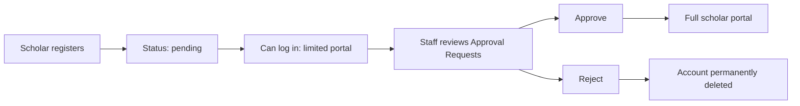
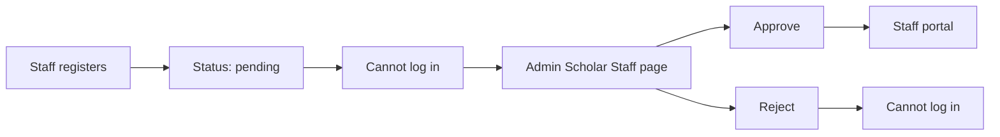
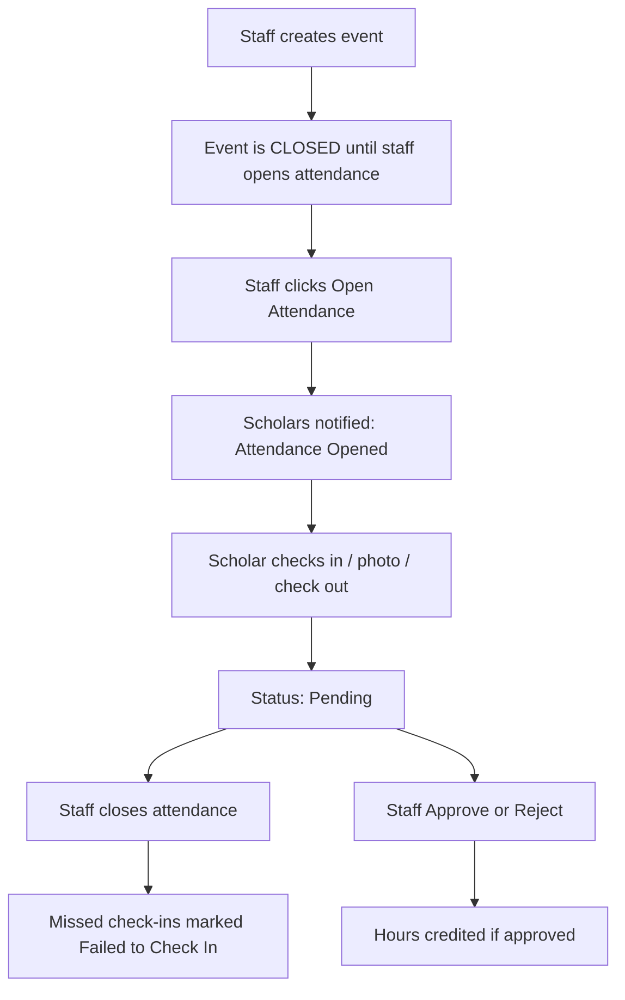

# Batang Surigaonon Scholar's App (BSSA)

<p align="center">
  
</p>

<h1 align="center">Batang Surigaonon Scholar's App</h1>

<p align="center">
  
  
  
  
</p>

A Laravel **web** application for managing the **Batang Surigaonon scholarship program**. It connects **scholars**, **scholar staff**, and **system administrators** around events, attendance, service hours, documents, approvals, and location-scoped scholarship programs (city vs province).

This README describes the **current codebase** in this repository. It is written from the routes, controllers, models, migrations, seeders, views, CSS, and configuration files that exist today.

It has two jobs:

1. **Technical documentation** for the live Laravel web system (every existing function, rule, and stylesheet).
2. **Conversion reference** for a future **React Native + Expo / Expo Go** mobile client that must keep **all** of those functions, workflows, permissions, and the **same CSS visual identity** — only the presentation layer changes.

The visual language below is taken from the live stylesheets — not a new theme.

<table>
  <tr>
    <td width="33%" bgcolor="#e7f7ef" valign="top">
      <p><strong>Scholar</strong> &nbsp; <code>/user</code></p>
      <p>Sidebar <code>#e7f7ef</code> → <code>#eaf9ef</code><br />
      Active / buttons <code>#2fa76a</code><br />
      Page <code>#f6f8fb</code> · cards white, 12px<br />
      Typeface Inter · <code>styles.css</code></p>
    </td>
    <td width="33%" bgcolor="#99ccff" valign="top">
      <p><strong>Scholar Staff</strong> &nbsp; <code>/staff</code></p>
      <p>Sidebar <code>#99ccff</code><br />
      Active / buttons <code>#1890ff</code><br />
      Page <code>#f0f4f8</code> · cards white<br />
      <code>staff-admin.css</code></p>
    </td>
    <td width="34%" bgcolor="#fff2f1" valign="top">
      <p><strong>Admin</strong> &nbsp; <code>/admin</code></p>
      <p>Sidebar <code>#fff2f1</code><br />
      Active / buttons <code>#c2410c</code><br />
      Page <code>#faf6f5</code> · shared staff cards<br />
      <code>admin.css</code></p>
    </td>
  </tr>
</table>

---

## Table of contents

1. [Project overview](#1-project-overview)
2. [What problem it solves](#2-what-problem-it-solves)
3. [User roles and permissions](#3-user-roles-and-permissions)
4. [System workflows](#4-system-workflows)
5. [Authentication and authorization](#5-authentication-and-authorization)
6. [Features by portal](#6-features-by-portal)
7. [Notifications](#7-notifications)
8. [Backend architecture](#8-backend-architecture)
9. [Frontend architecture](#9-frontend-architecture)
10. [Visual identity (existing CSS)](#10-visual-identity-existing-css)
11. [Database](#11-database)
12. [Routes](#12-routes)
13. [Project structure](#13-project-structure)
14. [Technologies, languages, and packages](#14-technologies-languages-and-packages)
15. [System requirements](#15-system-requirements)
16. [Installation and setup](#16-installation-and-setup)
17. [Environment configuration](#17-environment-configuration)
18. [Database setup](#18-database-setup)
19. [How to run the application](#19-how-to-run-the-application)
20. [Build and production notes](#20-build-and-production-notes)
21. [Seeded administrator account](#21-seeded-administrator-account)
22. [Security features](#22-security-features)
23. [Validation and error handling](#23-validation-and-error-handling)
24. [Troubleshooting](#24-troubleshooting)
25. [Development guide](#25-development-guide)
26. [Complete function catalog](#26-complete-function-catalog)
27. [CSS files and UI component map](#27-css-files-and-ui-component-map)
28. [Expo Go / React Native conversion](#28-expo-go--react-native-conversion)
29. [CSS to React Native style translation](#29-css-to-react-native-style-translation)
30. [Mobile UI adaptation](#30-mobile-ui-adaptation)
31. [Laravel API for the mobile client](#31-laravel-api-for-the-mobile-client)
32. [Scholarship program isolation](#32-scholarship-program-isolation)

---

## 1. Project overview

**Name in the UI:** Batang Surigaonon Scholar's App  
**Code location:** this Laravel application (`composer.json` name is `laravel/laravel`; the product logic lives under `app/`, `resources/views/`, and `database/`).

The system is a **role-based scholar portal** with three portals:

| Portal | URL prefix | Who uses it |
|--------|------------|-------------|
| Scholar (user) | `/user` | Approved and pending scholars |
| Scholar Staff | `/staff` | Approved scholar staff assigned to a scholarship program |
| Administrator | `/admin` | System administrators |

The root URL `/` redirects to the login page. After login, users are sent to the dashboard that matches their role.

City Scholarship Programs and Province Scholarship Programs are stored as separate `scholarship_programs` rows and are **not mixed** in staff or admin queries. Each program has its own scholars, staff, events, attendance, documents, reports, and statistics. Scope is always `scholarship_program_id` (see [§32](#32-scholarship-program-isolation)).

Required service hours for scholars: **30** (`ScholarService::REQUIRED_HOURS`). Hours come from approved attendance records, not from hardcoded dashboard numbers.

There is **no Expo / React Native app in this repository yet**. The web Laravel app remains the source of truth. A future mobile client must call this backend and reuse the existing CSS tokens ([§10](#10-visual-identity-existing-css), [§28](#28-expo-go--react-native-conversion)).

---

## 2. What problem it solves

The application supports day-to-day scholarship operations:

- Register scholars and scholar staff against a **specific city or province program**.
- Approve or reject new accounts before they get full access.
- Publish **events**, collect **participation**, and control **attendance sessions** (open/close).
- Collect **check-in / check-out** and a **participation photo**.
- Credit **service hours** after staff approval.
- Require and review **documents** by program-specific document types.
- Track **academic year / semester** for hours and reports.
- Give administrators a **system-wide view** filtered by location and program.

---

## 3. User roles and permissions

Roles are stored on `users.role` (`App\Models\User`):

| Constant | Value | Meaning |
|----------|--------|---------|
| `ROLE_SCHOLAR` | `scholar` | Scholar / regular user |
| `ROLE_SCHOLAR_STAFF` | `scholar_staff` | Scholar staff |
| `ROLE_ADMIN` | `admin` | Administrator |

`users.is_admin` is also used; `User::isAdmin()` is true when `is_admin` is true **or** `role` is `admin`.

Account status (`users.status`):

| Constant | Value | Typical use |
|----------|--------|-------------|
| `STATUS_PENDING` | `pending` | Waiting for approval |
| `STATUS_APPROVED` | `approved` | Active |
| `STATUS_REJECTED` | `rejected` | Denied |

### 3.1 Scholar

- **Can log in** unless status is `rejected`.
- **Pending scholars** can open Dashboard, Announcements (list + show + mark read), and Logout. Events, Calendar, Service Hours, Documents, Notifications, and Profile are blocked until staff approval (`EnsureScholarApproved` and sidebar `is-disabled` items). Announcements are **not** a sidebar item; they are opened from the dashboard and `/user/announcements`.
- **Approved scholars** get the full scholar portal listed in [§6.2](#62-scholar-portal-user).
- Scholars can only see events, announcements, document types, and hours for their assigned `scholarship_program_id` (`visibleLocationIds()` / `assertEventVisibleToUser`).
- Scholars **cannot edit or delete** submitted attendance records. They can register, check in, check out, and upload a photo **only while staff have opened attendance** for that event (`Event::isAttendanceOpen()`).
- Must **register** for the event before check-in. Check-in is blocked if the event has ended **and** attendance is closed.
- Attendance status shown to scholars: **Pending**, **Approved**, **Rejected**, and **Failed to Check In** when applied.
- Scholars cannot approve their own hours. `POST /user/attendances/{attendance}/approve` exists but **aborts 403 unless the user is an administrator**.

### 3.2 Scholar staff

- Registration starts as **pending**. Pending and rejected staff **cannot log in** to the staff portal (`EnsureScholarStaff`, `AuthController::login`).
- **Only administrators** see pending staff registrations and can Approve or Reject them.
- Pending staff **do not appear** in “All Scholar Staff Accounts” and are not counted as active staff.
- After approval, staff can manage **only their assigned program** (`managedLocationIds()` / `coveredLocationIds()`, which is that program’s own ID — never city+province mixed).
- Staff can approve/reject **scholars**, create events, open/close attendance, approve/reject attendance hours, view attendance photos, manage document types and reviews, and run the four report pages for their program.
- Staff **cannot** approve other staff accounts, cannot open another program’s events (`403` on `showEvent`), and cannot review document types outside their program (`ProgramScopeService::assertDocumentTypeManagedByStaff`).
- `staff/pending-approval` exists in `web.php` but `EnsureScholarStaff` logs pending staff out at login, so that page is not reachable in normal use.

### 3.3 Administrator

- Full `/admin` portal (`EnsureAdmin`).
- Can filter almost every admin page by **program type** (all / city / province) and **specific program**.
- Approves or rejects **scholar staff** only (not scholar accounts — those are staff’s job).
- Can view scholars, events, attendance, hours, documents, participation, and reports in the selected scope.
- Can manage location/program records (display name, active flag) and add locations.
- Can update their own name, email, and password.
- Can add a location (`province` or `city_municipality`) and edit `display_name` / `is_active`.
- Admin scholars list is **read-only** (search by name, email, scholar ID). Admin does **not** approve scholar accounts.
- `AnnouncementService::publish()` exists for program-scoped notices, but **no staff or admin create-announcement route is wired** in `web.php`. Scholars can only list/read announcements that already exist.

---

## 4. System workflows

### 4.1 Scholar registration and approval



1. Scholar submits `/register` with name, scholar ID, email, password, program (city/province tree), and optional school/contact fields.
2. `User::register()` creates the account; `AccountService::provisionNewAccount()` creates document placeholders and a pending-approval notification.
3. Staff on the same program see the scholar under **Approval Requests** and **Scholars**.
4. **Approve** sets status to `approved` and notifies the scholar.
5. **Reject** permanently deletes the scholar account (`AccountService::permanentlyDelete`).

### 4.2 Scholar staff registration and approval



1. Staff submits `/register/staff`.
2. Account is `scholar_staff` + `pending`. Admin is notified only via the admin **Scholar Staff** pending list and sidebar badge.
3. Other staff never see pending staff details.
4. Admin **Approve** sets `approved`. Admin **Reject** sets `rejected` (account remains; login is blocked).

### 4.3 Event, attendance, and service hours



- New events default to **attendance closed**. Event schedule times do **not** auto-open attendance.
- Staff **Open Attendance** / **Close Attendance** write timestamps, actor IDs, and `attendance_session_logs`, and notify scholars.
- While open, scholars may submit attendance. While closed, they cannot submit or change it.
- Staff approve or reject hours. Scholars see **Pending / Approved / Rejected**. Staff no longer have a free-form “Edit Attendance Record” form.
- Live status for scholars: `GET /user/attendance-status` polled about every 5 seconds (`resources/js/user-app.js`).

### 4.4 Documents

1. Staff define **document types** per scholarship program.
2. When a scholar is provisioned, placeholder `documents` rows are created (`ScholarService::ensureUserDocuments`).
3. Scholar uploads a file (stored on the `public` disk).
4. Staff review: approve, reject, or other status updates, with optional notes.

---

## 5. Authentication and authorization

### Login (`AuthController`)

- Email + password; email is lowercased.
- Remember-me duration is set to **10 years** (5,256,000 minutes) in `AppServiceProvider` so inactivity does not expire the account.
- After success, `last_login_at` is updated (`User::markLogin`).
- Redirect: admin → admin dashboard; approved staff → staff dashboard; scholar → user dashboard.
- Pending scholars see a pending-approval modal (session flag `show_pending_approval_modal`).

### Who can log in (`User::canLogin`)

- Admin: always (if credentials match).
- Scholar staff: only `approved`.
- Scholar: any status except `rejected`.

### Registration

- Scholar: unique email and scholar ID; password min 8 characters, confirmed.
- Staff: unique email/scholar ID rules in `assertStaffRegistrationIsUnique`; same password rules; status `pending`.
- Rate limits: login **5** attempts / 60s window; scholar register **3** / 60s; staff register **3** / 60s.

### Middleware aliases (`bootstrap/app.php`)

| Alias | Class | Effect |
|-------|--------|--------|
| `admin` | `EnsureAdmin` | 403 unless administrator |
| `scholar` | `EnsureScholar` | Scholar portal; rejected/staff-rejected users logged out |
| `scholar.approved` | `EnsureScholarApproved` | Pending scholars redirected to user dashboard |
| `scholar.staff` | `EnsureScholarStaff` | Staff portal; pending/rejected staff logged out |
| `scholar.staff.approved` | `EnsureScholarStaffApproved` | Staff feature routes require approved staff |

### Route-model binding (`AppServiceProvider`)

- `{staffMember}` resolves only `scholar_staff` users and **only for administrators** (others get 404).
- `{scholar}` resolves only `role = scholar` (staff cannot open a staff user via scholar URLs).

---

## 6. Features by portal

### 6.1 Public / auth pages

| Page | Route | Function |
|------|--------|----------|
| Login | `GET/POST /login` | Sign in |
| Scholar register | `GET/POST /register` | Create scholar account |
| Staff register | `GET/POST /register/staff` | Create pending staff account |
| Logout | `POST /logout` | End session |
| Event image | `GET /events/{event}/image` | Serve stored event image (auth required) |

### 6.2 Scholar portal (`/user`)

| Section | What it does |
|---------|----------------|
| **Dashboard** | Welcome, hour stats (approved / pending / remaining vs **30** required), upcoming events, pending attendances, announcements, recent activity, attendance OPEN/CLOSED cards, sidebar hour/calendar widgets, quick links |
| **Events** | List/select events for the scholar's program; confirm participation; check in; check out; upload participation photo (JPG/PNG, 5MB) while the session is open; view own photo; status badges |
| **Attendance live status** | JSON poll (~5s) for open/closed sessions and unread notification count (`#attendance-live-root`, `user-app.js`) |
| **Calendar** | Month calendar of program events; query `year` / `month` |
| **Service hours** | Approved/pending/remaining hours; filter by academic year and semester (`1st Semester` / `2nd Semester`) |
| **Documents** | Upload PDF/JPG/PNG (5MB) for types in the scholar's program only; approved / pending / rejected / not submitted; download own file |
| **Notifications** | All / Unread / Important; mark one or all read; preference toggles; show 5 latest then **See More** / **Show Less** |
| **Announcements** | List, show, mark one or all read. Available to pending scholars. Not a sidebar item — opened from the dashboard or `/user/announcements` |
| **Profile & Settings** | Editable: full name, cellphone, school, course/year, year level, date of birth, guardian, academic preference. Not editable on the account tab: email, scholar ID. Password has its own form. Delete account (current password + rate limit) |
| **Pending modal** | First-login overlay; dismiss via `POST /user/dismiss-pending-modal` |
| **Logout** | Sidebar outline button → `POST /logout` |

Global academic year/semester can be updated from the scholar profile **only by an administrator** (`ProfileActionController::updateGlobalAcademicSettings`).

### 6.3 Scholar staff portal (`/staff`)

| Section | What it does |
|---------|----------------|
| **Dashboard** | Live program stats (not fake numbers): scholars, events, pending attendance, hours, documents, pending approvals, recent activity, upcoming events — all from `StaffDashboardService` + `scholarship_program_id` |
| **Scholars** | List scholars in the assigned program; search; open a scholar profile (`canManageScholar`) |
| **Scholar detail** | Account overview for one scholar in the same program |
| **Approval Requests** | Pending scholar registrations; **Approve** (status `approved` + notify) or **Reject** (permanent delete via `AccountService::permanentlyDelete`). Sidebar red badge = pending count |
| **Events** | List events; **Create Event** (`title`, `description`, `location`, `starts_at`, `ends_at` after start, `service_hours` 0–999, `organizer`, JPG/PNG ≤5MB). New event `status` = `confirmed`, attendance **closed**. Notifies approved scholars in that program only. Event detail + registration count |
| **Attendance** | Per-event lists: checked in vs failed to check in; **Open / Close Attendance** with `.staff-confirm-modal`; Approve / Reject hours; view photos (`staff.attendances.photo`). No scholar-style edit-record form |
| **Documents** | CRUD document types (`name`, `description`, `required`) scoped to the staff program; provision placeholders for existing scholars; notify scholars. Review submissions: search, status filter, view, download, patch status + notes |
| **Calendar** | Staff calendar of program events (redirect target after create) |
| **Reports** | Four pages: service hours, attendance, participation, completion — same program IDs only |
| **Settings** | Read-only general/notification display; **Change Password** modal (current + new + confirm; `Password::min(8)->letters()->numbers()`; hashed via `User::updatePassword`; 5 attempts / 300s) |

### 6.4 Admin portal (`/admin`)

| Section | What it does |
|---------|----------------|
| **Dashboard** | Scope banner + **Location & Scholarship Program** dropdown (All Locations / All Programs, or a specific city/province program). Stats are queried for that scope only: scholars (total/approved/pending/rejected), approved staff, pending staff, events, attendance, service hours, documents, participation, completed scholars. Location Comparison UI has been removed from this page |
| **Locations** | City vs province lists kept separate. **Add:** `location_name`, `location_type` (`province` \| `city_municipality`), `province_name` (required for cities), `region_name`, `display_name`. **Edit:** `display_name`, `is_active` |
| **Scholars** | Read-only list in current scope; search name / email / scholar ID. No approve/reject here |
| **Scholar Staff** | Pending registrations (Approve → `approved`; Reject → `rejected`, account kept). All Scholar Staff Accounts shows approved/rejected, **not** pending |
| **Events** | Scoped event monitoring (no create on admin) |
| **Attendance** | Scoped attendance monitoring |
| **Service Hours** | Scoped hours monitoring |
| **Documents** | Scoped document monitoring |
| **Participation** | Scoped participation / failed-check-in monitoring |
| **Reports** | Combined stats and location summaries for the current filter only |
| **Admin Settings** | Update admin `full_name` / `email` (unique); change password (`Password::min(8)`, current required, session regenerate) |
| **Sidebar badge** | Polls `GET /admin/sidebar-badges` — JSON `{ staff: <pending count> }`. Red `.staff-nav-badge` only on **Scholar Staff**. Other admin keys may show `.staff-notif-badge` if a count is passed |

Admin scope is stored in session: `admin_location`, `admin_program_type`. Queries use `AdminDashboardService::resolveAdminProgramIds()`.

---

## 7. Notifications

In-app notifications use table `scholar_notifications` (`ScholarNotification`).

Typical categories used in the UI: `event_reminder`, `attendance`, `service_hours`, `documents`, `reminder`, `announcement`, `system`.

Examples of what the app writes today:

- Account pending / approved / welcome
- Staff account pending / approved / rejected
- Event published / confirmed
- Attendance opened / closed
- Participation / hours / photo / verification outcomes
- Password changed (scholar)

Scholar notification preferences (JSON on the user, `User::defaultNotificationPreferences()`): `event_reminders`, `attendance_updates`, `service_hours`, `document_updates`, `announcements` (all default `true`). Saved via `POST /user/notifications/settings`.

Unread count: `User::unreadNotificationCount()` (`is_read = false`). Shown as a red circle badge on the scholar **Notifications** nav item (hidden at 0; `99+` over 99). Live poll updates the badge.

The Notifications page loads **5** newest items first. Extra rows are in the page but hidden. **See More Notifications** / **Show Less Notifications** toggle them in the browser without deleting records.

Staff settings “Email Notifications” / “System Alerts” toggles on the staff Settings page are **display-only** (not wired to a save action).

There is **no separate email-sending implementation** in application code; `MAIL_MAILER` in `.env.example` defaults to `log`.

Flash messages use `partials/flash-messages.blade.php` (`success`, `error`, validation `$errors`).

---

## 8. Backend architecture

Laravel 12 MVC. There is **no** `routes/api.php` public API. A few JSON responses support the UI. When Expo is added, wrap these same controllers/services — see [§31](#31-laravel-api-for-the-mobile-client). Do not introduce a second data store.

### Controllers

| Controller | Responsibility |
|------------|----------------|
| `AuthController` | Login, register scholar/staff, logout, rate limits |
| `UserController` | Scholar pages + attendance status JSON + notification pages |
| `StaffController` | Staff pages, scholar approve/reject, attendance open/close/approve/reject, password change |
| `StaffDocumentController` | Document types and file review |
| `AdminController` | Admin pages, staff approve/reject, location CRUD, admin password |
| `EventActionController` | Scholar event register, check-in/out, photo, event image |
| `DocumentActionController` | Scholar upload/download |
| `NotificationActionController` | Mark read, settings |
| `AnnouncementActionController` | Mark announcements read |
| `ProfileActionController` | Profile, password, delete account, academic settings |

### Services

| Service | Responsibility |
|---------|----------------|
| `ScholarService` | Hours, documents, calendar, notifications, missed check-ins, activity log |
| `StaffDashboardService` | Staff/admin stats and reports scoped by program IDs |
| `AdminDashboardService` | Admin scope, staff queries, dashboard stats |
| `AttendanceSessionService` | Open/close attendance, notify scholars, live status payload |
| `AccountService` | Provision new scholar/staff; permanent delete |
| `AnnouncementService` | Announcements for a user |
| `AcademicSettingsService` | Global and per-user academic year/semester; `1st Semester` / `2nd Semester` |
| `ProgramScopeService` | Program-type totals |
| `ScholarshipProgramAssignmentService` | Resolve city/province assignment on register |
| `ScholarshipProgramImportService` | Import programs from `database/data/psgc-locations.json` |

### Models

`User`, `ScholarshipProgram`, `Event`, `EventRegistration`, `Attendance`, `AttendanceSessionLog`, `Document`, `DocumentType`, `Announcement`, `AnnouncementRead`, `ScholarNotification`, `UserActivity`, `AcademicSetting`.

Passwords use the Eloquent `hashed` cast. `User::updatePassword()` and `User::register()` set the password through that cast (not mass assignment of `password`).

---

## 9. Frontend architecture

- **Blade** templates under `resources/views/` (`layouts/app.blade.php`, `user`, `staff`, `admin`, `auth`).
- **Vite** bundles `resources/css/styles.css`, `resources/css/app.css`, `resources/js/app.js`, `resources/js/user-app.js`.
- **Tailwind CSS v4** is in the Vite pipeline (`@tailwindcss/vite`). Most staff/admin UI is custom CSS in `public/css/staff-admin.css` and `public/css/admin.css`.
- Scholar UI: `resources/css/styles.css` plus page CSS (`notifications-page.css`, `dashboard-events.css`, `documents-page.css`, `profile-page.css`, `service-hours-page.css`, `pending-approval-modal.css`, `user-nav.css`).
- Static JS: `public/js/notifications-toggle.js` plus inline scripts on some pages (staff password modal, admin dashboard selector).

Layouts:

- `layouts.app` — HTML shell, Inter font, Vite styles.
- `layouts.user` — scholar sidebar + topbar + attendance live root.
- `layouts.staff` — staff sidebar + topbar + confirm modal.
- `layouts.admin` — admin sidebar + topbar + staff-badge poll.

Scholar pages use white `.card` blocks (12px radius, light shadow), green `.btn` fills, outline green buttons, and uppercase 12px `.card-header` labels. Staff/admin pages use `.staff-card`, `.staff-btn` / `.staff-btn-primary`, `.staff-table`, and `.staff-stat-card` from `staff-admin.css`, with admin recoloring those tokens in `admin.css`.

---

## 10. Visual identity (existing CSS)

This documentation follows the **same tokens the app already uses**. Do not introduce a separate brand for docs or new screens.

### Scholar portal — `resources/css/styles.css`

```css
:root {
    --green: #2fa76a;
    --green-2: #e7f7ef;
    --muted: #8a8f98;
    --card-bg: #ffffff;
    --radius: 12px;
    --shadow: 0 6px 18px rgba(24, 39, 75, 0.06);
}
```

| Token / class | Value in the app |
|---------------|------------------|
| Page background | `#f6f8fb` |
| Body text | `#1f2937` |
| Typeface | **Inter** (300–800), loaded in `layouts/app.blade.php` |
| Sidebar | Gradient `#e7f7ef` → `#eaf9ef`; active nav `#2fa76a` + white text |
| Logo mark | Gradient `#0ea96d` → `#2fa76a`, 12px radius |
| Cards | White, 12px radius, `--shadow` |
| Primary button `.btn` | `#2fa76a` fill, white text, 8px radius |
| Outline button `.btn.outline` | Transparent fill, `#2fa76a` border |
| Program badge | White card, `#b6ebb9` border, `#166534` text |
| Notification badge `.nav-notif-badge` | `#ef4444` pill, white count (`user-nav.css` + `styles.css`) |
| Status badges | Pending `#c27a00`; approved green; rejected `#fee2e2` / `#dc2626` |

### Scholar staff portal — `public/css/staff-admin.css`

| Token | Value |
|-------|--------|
| `--staff-sidebar` | `#99ccff` |
| `--staff-sidebar-text` | `#0b2d4d` |
| `--staff-sidebar-active` / `--staff-primary` | `#1890ff` |
| `--staff-bg` | `#f0f4f8` |
| `--staff-card` | `#ffffff` |
| `--staff-border` | `#e5e7eb` |
| `--staff-text` | `#1f2937` |
| `--staff-muted` | `#6b7280` |

Primary staff actions use `.staff-btn-primary` (blue `#1890ff`). Confirm dialogs use the existing `.staff-confirm-modal`: white `.staff-confirm-dialog` (16px radius), backdrop `rgba(15, 39, 68, 0.45)`.

### Admin portal — `public/css/admin.css`

Admin **reuses** staff components and only overrides colors:

| Token | Value |
|-------|--------|
| `--admin-sidebar` | `#fff2f1` |
| `--admin-sidebar-text` | `#5c1a14` |
| `--admin-sidebar-active` / `--admin-primary` | `#c2410c` |
| Page background | `#faf6f5` |
| Location banner / pills | `#fff2f1` fill, `#f5d0c8` border |

### UI patterns to keep

- **Navigation:** rounded 10px items; active item is a solid brand color (green / blue / orange).
- **Cards:** white surface, 12px corners, light border or shadow — not heavy drop shadows.
- **Tables:** `.staff-table` on staff/admin; compact headers, muted secondary text.
- **Spacing:** 16–24px gaps between cards (`gap` / `margin-bottom` already used in the CSS).
- **Badges:** pill (`border-radius: 999px`) for counts and OPEN/CLOSED attendance.

When adding README screenshots or UI notes, use these hex values. Do not switch the scholar portal to staff blue or admin orange.

### CSS files and what they style

| File | Loaded from | Styles |
|------|-------------|--------|
| `resources/css/styles.css` | `layouts/app.blade.php` via Vite | Scholar shell: `:root` tokens, sidebar, nav, cards, buttons, tables, badges, forms, calendar, auth pages, alerts, dashboard widgets |
| `resources/css/app.css` | Laravel welcome / Vite default | Tailwind entry — **not** the scholar/staff/admin product UI |
| `public/css/user-nav.css` | `layouts/user.blade.php` | Nav row + `.nav-notif-badge` (`#ef4444` pill) |
| `public/css/pending-approval-modal.css` | User layout (pending) + staff pending view | Centered 16px white panel, `rgba(15, 39, 68, 0.45)` backdrop, amber icon `#fef3c7` / `#d97706` |
| `public/css/dashboard-events.css` | `user/dashboard.blade.php` | Upcoming-event row grid (date / thumb / details / action) |
| `public/css/attendance-photo.css` | Events + calendar | Dashed 12px drop zone `#d1d5db`, preview 10px radius, rejected note `#b91c1c` |
| `public/css/service-hours-page.css` | `user/service-hours.blade.php` | Main + 340px sticky sidebar, 20px gap, charts |
| `public/css/documents-page.css` | `user/documents.blade.php` | Main + 320px sidebar, 24px gap |
| `public/css/notifications-page.css` | `user/notifications.blade.php` | Main + 320px settings column; hidden extra items |
| `public/css/profile-page.css` | `user/profile.blade.php` | Section cards 20px padding, 24px stack, sidebar help |
| `public/css/staff-admin.css` | Staff + admin layouts | Staff tokens, `.staff-sidebar`, `.staff-nav-item`, `.staff-card`, `.staff-stat-card`, `.staff-table`, `.staff-btn`, filters, confirm modal |
| `public/css/admin.css` | Admin layout **after** staff-admin | Recolors staff tokens to orange/peach; location banner/pills |

### Scholar component tokens (from `styles.css`)

| Component | Classes / rules |
|-----------|-----------------|
| **Typography** | Inter 300–800; title 14px/700 `#0f1721`; topbar `h1` 26px; card headers 12px uppercase 0.3px tracking; muted `#8a8f98` |
| **Sidebar** | 300px; gradient `#e7f7ef` → `#eaf9ef`; padding 28×20; gap 20px; collapsible `.sidebar.collapsed` |
| **Nav** | `.nav-item` 12×14 padding, 10px radius, weight 600; `.active` fill `#2fa76a` + white + `--shadow`; disabled pending items are `<span class="nav-item is-disabled">` |
| **Header / topbar** | Flex space-between; 18px bottom margin; muted subtitle |
| **Cards** | `.card` white, 12px radius, 16px padding, `--shadow` |
| **Buttons** | `.btn` green 8px radius; `.btn.outline` green border; `.btn.small`; `.btn.full`; `.btn.blue` `#2563eb`; `.btn.danger` red outline |
| **Forms** | `.form-grid` 2-col 16px gap; labels 12px uppercase muted; inputs 12×14, 8px radius, `#e6eef0` border, `#f9fafb` fill; focus border `--green`; disabled `#f3f4f6` |
| **Tables** | `.table` collapse; th muted 13px; td 12px + `#f1f5f9` top border |
| **Badges** | 8px radius (or pill 999px); pending `#fff4e6`/`#c27a00`; confirmed green; rejected `#fee2e2`/`#dc2626`; open `#dcfce7`/`#166534`; closed gray |
| **Alerts** | Success `#d4f7db`/`#b6ebb9`/`#155724`; error `#fee2e2`/`#fecaca`/`#dc2626`; 8px radius |
| **Modals** | Pending-approval: 16px white panel, 480px max, amber icon |

### Staff / admin components (from `staff-admin.css` + `admin.css`)

| Component | Classes / rules |
|-----------|-----------------|
| **Sidebar** | `.staff-sidebar`; staff `#99ccff` text `#0b2d4d`; admin `#fff2f1` text `#5c1a14` |
| **Nav** | `.staff-nav-item` 10px radius; hover translucent white (staff) or `rgba(194, 65, 12, 0.08)` (admin); `.active` solid primary + white |
| **Stat cards** | `.staff-stat-grid` 5 columns 16px gap; `.staff-stat-card` white, 12px, 1px `#e5e7eb`, light shadow; icon 42px / 10px radius (blue/green/orange/purple/teal/red/gray) |
| **Cards** | `.staff-card` 20px padding, 12px radius, 1px border |
| **Buttons** | `.staff-btn` 8px; `.staff-btn-primary` fill `--staff-primary` (blue or admin orange) |
| **Tables** | `.staff-table-wrap` horizontal scroll; `.staff-table` 14px |
| **Filters** | `.staff-filter-bar` white 12px card; `.staff-search` `#f9fafb` 8px |
| **Confirm modal** | `.staff-confirm-modal` / `.staff-confirm-dialog` 16px, backdrop `rgba(15, 39, 68, 0.45)` |

Page layouts that a mobile port must preserve (same data, stacked on small screens): notifications/documents **1fr + 320px**; service hours **1fr + 340px**; staff dashboard **5-stat row** then **2fr / 1fr** grids.

---

## 11. Database

**Default connection in `.env.example`:** SQLite (`DB_CONNECTION=sqlite`). MySQL variables are present but commented out.

**Session, cache, and queue** in `.env.example`: `database` driver.

### Tables (from migrations)

| Table | Purpose |
|-------|---------|
| `users` | Accounts (scholars, staff, admin) |
| `password_reset_tokens` | Laravel password-reset tokens (table exists; no in-app reset UI is wired in `web.php`) |
| `sessions` | Database sessions |
| `cache`, `cache_locks` | Cache |
| `jobs`, `job_batches`, `failed_jobs` | Queue |
| `scholarship_programs` | City/province programs (PSGC fields, type, names) |
| `events` | Events + attendance session columns + `image_path` |
| `event_registrations` | Scholar ↔ event |
| `attendances` | Check-in/out, hours, status, photo, academic period |
| `attendance_session_logs` | Open/close audit |
| `document_types` | Required docs per program |
| `documents` | Uploads and review |
| `announcements` | Notices (optional program + announcement reads) |
| `announcement_reads` | Read receipts |
| `scholar_notifications` | In-app notifications (`announcement_id`, `event_id`) |
| `user_activities` | Activity feed |
| `academic_settings` | Global year/semester |

### Important `users` fields

`full_name`, `scholar_id`, `email`, `password`, `role`, `is_admin`, `status`, `scholarship_program_id`, `city`, `province`, school/contact/guardian fields, `notification_preferences`, `academic_year_start`, `semester`, `last_login_at`, `avatar_path`.

### Attendance statuses (`Attendance`)

`pending`, `approved`, `rejected`, `failed_to_check_in`.

### Relationships (high level)

- Program `hasMany` users (scholars / approved staff), events, announcements.
- User `hasMany` attendances, documents, notifications, activities, registrations.
- Event `hasMany` attendances, registrations, session logs.
- Document `belongsTo` user and document type.

### Seeders

- `ScholarshipProgramSeeder` — imports nationwide locations via `ScholarshipProgramImportService` from `database/data/psgc-locations.json`.
- `AdminSeeder` — creates/updates the administrator user (see [§21](#21-seeded-administrator-account)).
- `DatabaseSeeder` — runs both seeders, then creates current `academic_settings` (this year → next year, `2nd Semester`).

### Factories

`UserFactory` exists for tests/factories. Feature tests in `tests/` are still Laravel example tests, not product coverage.

---

## 12. Routes

All application routes are in `routes/web.php`. Health check: `GET /up`.

Named routes use prefixes `admin.*`, `staff.*`, `user.*`.

### Scholar routes (`auth` + `scholar`; approved group noted)

| Method | Path | Name | Access |
|--------|------|------|--------|
| GET | `/user/dashboard` | `user.dashboard` | Scholar including pending |
| POST | `/user/dismiss-pending-modal` | `user.dismiss-pending-modal` | Scholar including pending |
| GET | `/user/announcements` | `user.announcements` | Scholar including pending |
| GET | `/user/announcements/{announcement}` | `user.announcements.show` | Scholar including pending |
| POST | `/user/announcements/read-all` | `user.announcements.read-all` | Scholar including pending |
| POST | `/user/announcements/{announcement}/read` | `user.announcements.read` | Scholar including pending |
| GET | `/user/events` | `user.events` | Approved |
| GET | `/user/attendance-status` | `user.attendance.status` | Approved (JSON) |
| GET | `/user/calendar` | `user.calendar` | Approved |
| GET | `/user/service-hours` | `user.service-hours` | Approved |
| GET | `/user/documents` | `user.documents` | Approved |
| GET | `/user/notifications` | `user.notifications` | Approved |
| GET | `/user/notifications/more` | `user.notifications.more` | Approved |
| GET | `/user/profile` | `user.profile` | Approved |
| POST | `/user/events/{event}/register` | `user.events.register` | Approved |
| POST | `/user/events/{event}/check-in` | `user.events.check-in` | Approved + session open |
| POST | `/user/events/{event}/check-out` | `user.events.check-out` | Approved + session open |
| POST | `/user/events/{event}/photo` | `user.events.photo` | Approved + session open |
| GET | `/user/attendances/{attendance}/photo` | `user.attendances.photo` | Owner only |
| POST | `/user/attendances/{attendance}/approve` | `user.attendances.approve` | **Admin only** (403 otherwise) |
| POST | `/user/documents/upload` | `user.documents.upload` | Approved; type must match program |
| GET | `/user/documents/{document}/download` | `user.documents.download` | Owner only |
| POST | `/user/notifications/{notification}/read` | `user.notifications.read` | Owner only |
| POST | `/user/notifications/read-all` | `user.notifications.read-all` | Approved |
| POST | `/user/notifications/settings` | `user.notifications.settings` | Approved |
| PUT | `/user/profile` | `user.profile.update` | Approved |
| PUT | `/user/profile/guardian` | `user.profile.guardian` | Approved |
| PUT | `/user/profile/academic` | `user.profile.academic` | Approved |
| PUT | `/user/profile/academic/global` | `user.profile.academic.global` | Admin only |
| PUT | `/user/profile/password` | `user.profile.password` | Approved |
| DELETE | `/user/profile` | `user.profile.destroy` | Approved |

### Staff routes (`auth` + `scholar.staff`; most need `scholar.staff.approved`)

| Method | Path | Name |
|--------|------|------|
| GET | `/staff/dashboard` | `staff.dashboard` |
| GET | `/staff/scholars` | `staff.scholars` |
| GET | `/staff/scholars/{scholar}` | `staff.scholars.show` |
| POST | `/staff/scholars/{scholar}/approve` | `staff.scholars.approve` |
| POST | `/staff/scholars/{scholar}/reject` | `staff.scholars.reject` |
| GET | `/staff/approval-requests` | `staff.approval-requests` |
| GET/POST | `/staff/events`, `/staff/events/create` | `staff.events`, `staff.events.create`, `staff.events.store` |
| GET | `/staff/events/{event}` | `staff.events.show` |
| GET | `/staff/attendance` | `staff.attendance` |
| POST | `/staff/events/{event}/attendance/open` | `staff.attendance.open` |
| POST | `/staff/events/{event}/attendance/close` | `staff.attendance.close` |
| GET | `/staff/attendances/{attendance}/photo` | `staff.attendances.photo` |
| POST | `/staff/attendances/{attendance}/approve` | `staff.attendances.approve` |
| POST | `/staff/attendances/{attendance}/reject` | `staff.attendances.reject` |
| GET/POST | `/staff/documents` … | types CRUD + `view` / `download` / `status` |
| GET | `/staff/calendar` | `staff.calendar` |
| GET | `/staff/settings` | `staff.settings` |
| PUT | `/staff/settings/password` | `staff.settings.password` |
| GET | `/staff/reports/{service-hours\|attendance\|participation\|completion}` | `staff.reports.*` |

### Admin routes (`auth` + `admin`)

| Method | Path | Name |
|--------|------|------|
| GET | `/admin/dashboard` | `admin.dashboard` |
| GET | `/admin/sidebar-badges` | `admin.sidebar-badges` |
| GET/POST | `/admin/locations` | `admin.locations`, `admin.locations.store` |
| GET/PUT | `/admin/locations/{location}` | `admin.locations.edit`, `admin.locations.update` |
| GET | `/admin/scholars` | `admin.scholars` |
| GET | `/admin/staff` | `admin.staff` |
| POST | `/admin/staff/{staffMember}/approve` | `admin.staff.approve` |
| POST | `/admin/staff/{staffMember}/reject` | `admin.staff.reject` |
| GET | `/admin/events` | `admin.events` |
| GET | `/admin/attendance` | `admin.attendance` |
| GET | `/admin/service-hours` | `admin.service-hours` |
| GET | `/admin/documents` | `admin.documents` |
| GET | `/admin/participation` | `admin.participation` |
| GET | `/admin/reports` | `admin.reports` |
| GET/PUT | `/admin/settings` | `admin.settings`, `admin.settings.update` |
| PUT | `/admin/settings/password` | `admin.settings.password` |

Also: `GET /` → login; `GET /dashboard` role redirect; `GET /up` health.

### JSON / XHR used by the UI

| Method | Path | Name | Purpose |
|--------|------|------|---------|
| GET | `/admin/sidebar-badges` | `admin.sidebar-badges` | Pending staff count |
| GET | `/user/attendance-status` | `user.attendance.status` | Live attendance + unread count |
| GET | `/user/notifications/more` | `user.notifications.more` | Extra notification HTML (optional; page also embeds extras) |

There is no versioned REST API for third-party clients.

---

## 13. Project structure

```
scholar/
├── app/
│   ├── Http/Controllers/     # HTTP entry points
│   ├── Http/Middleware/      # Role and approval gates
│   ├── Models/               # Eloquent models
│   ├── Providers/            # AppServiceProvider (auth duration, route binds)
│   └── Services/             # Domain logic
├── bootstrap/app.php         # Middleware aliases, routing
├── config/                   # Laravel config (filesystems, auth, database, …)
├── database/
│   ├── data/psgc-locations.json
│   ├── migrations/
│   ├── seeders/
│   └── factories/
├── public/                   # Web root (index.php, css/, js/)
├── resources/
│   ├── css/                  # Vite CSS
│   ├── js/                   # user-app.js (sidebar, live attendance, badge)
│   └── views/                # Blade
├── routes/web.php
├── storage/                  # logs, compiled views, app/public uploads
├── tests/
├── artisan
├── composer.json
├── package.json
├── vite.config.js
└── .env.example
```

Uploads used by the app:

- Event images: public disk, `event_images/`
- Attendance photos: public disk, `attendance_photos/{user_id}/`
- Documents: public disk, `documents/{user_id}/`

`php artisan storage:link` is required so `/storage/...` can be served.

---

## 14. Technologies, languages, and packages

### Languages

| Language | Where |
|----------|--------|
| PHP 8.2+ | Backend |
| Blade | Views |
| JavaScript | Vite bundle + `public/js` |
| CSS | Vite + `public/css` |
| SQL | Via Laravel migrations (SQLite or other configured driver) |
| JSON | PSGC location import |

### Frameworks and tools (from lock/manifest files)

**PHP (`composer.json` / `composer.lock`):**

| Package | Constraint / locked |
|---------|---------------------|
| `laravel/framework` | `^12.0` / **v12.62.0** |
| `laravel/tinker` | `^2.10.1` |
| `laravel/pint` | `^1.24` (dev) |
| `laravel/sail` | `^1.41` (dev) |
| `laravel/pail` | `^1.2.2` (dev) |
| `phpunit/phpunit` | `^11.5.50` (dev) |
| `fakerphp/faker` | `^1.23` (dev) |
| `mockery/mockery` | `^1.6` (dev) |
| `nunomaduro/collision` | `^8.6` (dev) |

**JavaScript (`package.json`):**

| Package | Version |
|---------|---------|
| `vite` | `^7.0.7` |
| `laravel-vite-plugin` | `^2.0.0` |
| `tailwindcss` | `^4.0.0` |
| `@tailwindcss/vite` | `^4.0.0` |
| `axios` | `^1.11.0` |
| `concurrently` | `^9.0.1` |

**Other runtime pieces**

- Laravel Eloquent ORM, Blade, Vite, session/cache/queue on the database by default.
- Font: Inter (Google Fonts) in `layouts/app.blade.php`.
- Avatar placeholders: `ui-avatars.com` in some sidebars.

---

## 15. System requirements

- PHP **8.2 or newer** with common Laravel extensions (openssl, pdo, mbstring, tokenizer, xml, ctype, json, fileinfo)
- Composer 2
- Node.js + npm (for Vite)
- SQLite (default) **or** another database if you change `.env`
- Ability to create `public/storage` → `storage/app/public`

---

## 16. Installation and setup

From the application directory (the folder that contains `artisan`):

```bash
composer install
copy .env.example .env
php artisan key:generate
```

On macOS/Linux use `cp .env.example .env` instead of `copy`.

```bash
php artisan migrate --force
php artisan db:seed
php artisan storage:link
npm install
npm run build
```

One-shot Composer script (installs deps, copies `.env` if missing, key, migrate, npm install + build):

```bash
composer setup
```

`composer setup` does **not** run `db:seed` or `storage:link`. Run those separately.

---

## 17. Environment configuration

Copy `.env.example` to `.env`. Do not commit `.env`.

Relevant keys from `.env.example`:

| Variable | Role |
|----------|------|
| `APP_NAME`, `APP_ENV`, `APP_KEY`, `APP_DEBUG`, `APP_URL` | App identity and URL |
| `APP_TIMEZONE` | Default `Asia/Manila` |
| `APP_LOCALE` | `en` |
| `DB_CONNECTION` | Default `sqlite` |
| `SESSION_DRIVER` | `database`; `SESSION_LIFETIME=5256000` |
| `QUEUE_CONNECTION` | `database` |
| `CACHE_STORE` | `database` |
| `FILESYSTEM_DISK` | `local` (uploads still use the `public` disk in code) |
| `MAIL_*` | Default mailer `log` |
| `VITE_APP_NAME` | Exposed to Vite |

If you use SQLite, ensure `database/database.sqlite` exists (Laravel’s create-project script can create it; otherwise `touch database/database.sqlite` or create the file manually).

If you switch to MySQL, uncomment and set `DB_HOST`, `DB_PORT`, `DB_DATABASE`, `DB_USERNAME`, `DB_PASSWORD`.

---

## 18. Database setup

```bash
php artisan migrate
php artisan db:seed
```

Refresh (destroys data):

```bash
php artisan migrate:fresh --seed
```

---

## 19. How to run the application

**PHP server only** (use built Vite assets from `npm run build`):

```bash
php artisan serve
```

Open `http://127.0.0.1:8000` (or the host/port Artisan prints).

**Full local stack** (server + queue listener + pail logs + Vite):

```bash
composer dev
```

Or separately:

```bash
php artisan serve
php artisan queue:listen --tries=1 --timeout=0
npm run dev
```

Log in at `/login`. Register scholars at `/register` and staff at `/register/staff`.

The UI you see is the existing web design: scholar green sidebar (`#2fa76a`), staff blue sidebar (`#99ccff` / `#1890ff`), admin peach/orange sidebar (`#fff2f1` / `#c2410c`).

### Mobile / Expo Go (current repo)

This repository is a **Laravel web application only**. There is no Expo, React Native, or `app.json` project in the tree today, so **Expo Go cannot load this app yet**.

Scholars, staff, and admins use a browser (desktop or mobile web). To try the **existing web CSS** on a phone, serve the Laravel app on your LAN (for example `http://YOUR_LAN_IP:8000`) and open that URL in the phone browser.

A future native client must follow [§28](#28-expo-go--react-native-conversion)–[§31](#31-laravel-api-for-the-mobile-client): same functions, same Laravel database, same design tokens. Do not ship a simplified Expo demo with hardcoded scholars, events, or stats.

---

## 20. Build and production notes

```bash
npm run build
php artisan config:cache
php artisan route:cache
php artisan view:cache
```

Point the web server document root to `public/`. Keep `APP_DEBUG=false` in production. Run `php artisan storage:link` on the server. Set a strong `APP_KEY` and database credentials. Change the seeded administrator password immediately.

Laravel Sail is listed as a Composer dev dependency; this README does not assume a Sail-specific deploy unless you add one.

---

## 21. Seeded administrator account

`AdminSeeder` creates or updates an administrator with:

- **Email:** `bssa_admin@gmail.com`
- **Name:** BSSA Administrator
- **Scholar ID:** `ADMIN-001`
- **Role:** admin, approved

The initial password is defined in `database/seeders/AdminSeeder.php`. **Do not publish that password.** Change it after first login via **Admin Settings → Change Password**.

No other demo scholar or staff passwords are defined in seeders.

---

## 22. Security features

- Passwords hashed with Laravel’s `hashed` cast (bcrypt; `BCRYPT_ROUNDS=12` in `.env.example`).
- CSRF tokens on forms (`@csrf`).
- Role middleware on all three portals.
- Login/register rate limiting.
- Session regeneration after login and after password change.
- Password change requires current password; new password must differ, be confirmed, and meet `Password::min(8)` (staff also requires letters + numbers).
- Account delete (scholar) requires current password and is rate limited.
- Staff approve/reject of other staff is admin-only; route binding hides staff IDs from non-admins.
- Pending staff records are excluded from staff-visible lists and from `ScholarshipProgram::staff()`.
- Uploaded files go through authenticated download/view routes, not raw public listing.
- Mass assignment: login credentials are not in `$fillable` on `User`.
- Event images: staff/admin/scholar may view only if the event is in their program (`viewEventImage`).
- Attendance photos: scholar route is owner-only; staff route is staff-controlled.
- Documents: scholar download owner-only; upload rejects types from another `scholarship_program_id` (`403`).
- Notifications: mark-read is owner-only (`notification.user_id === Auth::id()`).
- Global academic settings: admin only (`403` for scholars).
- Password change (scholar): rate limited; staff password change 5 attempts / 300 seconds.
- Remember-me duration: 5,256,000 minutes (10 years) in `AppServiceProvider`.
- The Expo client must enforce the **same** rules on the server (never only in the UI).

---

## 23. Validation and error handling

- Form requests use Laravel `validate()` with custom messages (registration program required, unique email/scholar ID, password confirmation, etc.).
- Failed validation returns to the form with `$errors` (shown in flash partial).
- `abort(403)` / `abort(404)` / `abort(422)` for authorization and invalid state (e.g. approving a non-pending account).
- File uploads: event images JPG/JPEG/PNG, max 5MB (staff event create).
- Attendance mutations check `isAttendanceOpen()`.
- `canManageScholar()` requires the target to be a scholar in the staff member’s program.

Uncaught exceptions follow Laravel’s default handler (`bootstrap/app.php` has an empty `withExceptions` callback).

---

## 24. Troubleshooting

| Problem | What to check |
|---------|----------------|
| Vite CSS/JS missing | Run `npm install` and `npm run build`, or `npm run dev` alongside `artisan serve` |
| 404 on uploaded images/files | `php artisan storage:link` |
| SQLite errors | Create `database/database.sqlite`; `DB_CONNECTION=sqlite` |
| Login loop / 403 on staff | Account must be `scholar_staff` + `approved` |
| Scholar cannot open Events | Account still `pending` |
| Attendance buttons disabled | Staff have not opened the session |
| Pending staff missing from All Staff | Intended — pending only on Admin pending list |
| Session/cache/queue tables missing | Run all migrations |
| Wrong dashboard numbers in admin | Confirm Location & Scholarship Program selection; stats use `programIds` on the server |
| Blade looks stale | `php artisan view:clear` |
| CSRF 419 | Refresh the page; check `SESSION_*` and `APP_URL` |

---

## 25. Development guide

- Keep city and province programs separate. Scope queries with `scholarship_program_id` / `resolveAdminProgramIds()`.
- Do not open attendance from event start/end times; use `AttendanceSessionService`.
- Do not add scholar-side edit/delete of attendance records.
- Pending staff must stay admin-only (query + UI + routes).
- Add domain logic in `app/Services` and keep controllers thin.
- New scholar pages: Blade under `resources/views/user/` + route in the `scholar` / `scholar.approved` groups.
- New staff pages: `resources/views/staff/` + `scholar.staff.approved` group.
- After adding Vite entry files, register them in `vite.config.js`.
- Static CSS that must load without Vite belongs in `public/css/`.
- Keep new UI on the existing tokens in `styles.css`, `staff-admin.css`, and `admin.css` (see [§10](#10-visual-identity-existing-css)). Do not introduce a fourth color system.
- Run `vendor/bin/pint` for PHP style if you use Pint.
- `composer test` runs PHPUnit (currently example tests only).
- A React Native / Expo client is a **new presentation layer**. Do not fork business rules into the mobile app. Call the existing Laravel services/API and keep city vs province programs isolated ([§28](#28-expo-go--react-native-conversion)–[§32](#32-scholarship-program-isolation)).

---

## 26. Complete function catalog

This catalog matches `routes/web.php` and the controllers. The Expo app must expose **every** row that the role can use today. Do not drop reports, photo upload, document CRUD, location add, or pending-staff approval “to make mobile simpler.”

### Public / auth

- Login (email + password, remember me, rate limit 5/60s)
- Scholar register (program picker, unique email/scholar ID, min 8 password)
- Staff register (same uniqueness rules, status pending, cannot log in until admin approves)
- Logout (invalidate session)
- Authenticated event image stream

### Scholar (pending)

- Dashboard (limited)
- Announcements list / show / mark read / mark all read
- Pending-approval modal + dismiss
- Logout
- Blocked: events, calendar, hours, documents, notifications, profile

### Scholar (approved)

- Full dashboard with live hour stats and attendance session cards
- Events: register, check-in, check-out, photo, view own photo
- Live attendance JSON poll
- Calendar
- Service hours + academic filters
- Documents upload/download
- Notifications list/filters/settings/see more
- Profile, guardian, academic preference, password, delete account
- Program-scoped data only

### Scholar staff (approved)

- Dashboard stats for **one** program
- Scholars list + detail
- Approve / reject scholars
- Events list / create / show
- Attendance open/close, approve/reject hours, view photos
- Document types CRUD + review
- Calendar
- Four report pages
- Settings password change

### Administrator

- Dashboard scoped by location/program (real queries, no invented totals)
- Locations add/edit
- Scholars monitor
- Staff approve/reject + all-staff list (no pending in all-staff)
- Events, attendance, hours, documents, participation, reports (monitor)
- Settings name/email/password
- Sidebar pending-staff badge poll

### Backend services that must stay authoritative

`ScholarService`, `StaffDashboardService`, `AdminDashboardService`, `AttendanceSessionService`, `AccountService`, `AnnouncementService`, `AcademicSettingsService`, `ProgramScopeService`, `ScholarshipProgramAssignmentService`.

Mobile screens must consume their results. **Do not hardcode** scholar counts, hour totals, events, documents, or notifications.

---

## 27. CSS files and UI component map

Treat [§10](#10-visual-identity-existing-css) as the design system. Recreate the same components in React Native; do not invent a fourth palette.

| Web surface | Blade / layout | CSS | Mobile equivalent (same tokens) |
|-------------|----------------|-----|----------------------------------|
| Scholar shell | `layouts/user` + `partials/user-sidebar` + `user-topbar` | `styles.css`, `user-nav.css` | Drawer or bottom tabs in scholar green |
| Scholar dashboard | `user/dashboard` | `styles.css`, `dashboard-events.css` | Stacked cards, same stat colors |
| Events / photo | `user/events` | `styles.css`, `attendance-photo.css` | Same badges + dashed upload zone |
| Service hours | `user/service-hours` | `service-hours-page.css` | Sidebar cards below the chart |
| Documents | `user/documents` | `documents-page.css` | Overview card + list |
| Notifications | `user/notifications` | `notifications-page.css` | List + settings sheet |
| Profile | `user/profile` | `profile-page.css` | Section cards |
| Pending modal | `partials/pending-approval-modal` | `pending-approval-modal.css` | RN `Modal` / dialog |
| Staff shell | `layouts/staff` | `staff-admin.css` | Blue drawer / tabs |
| Staff tables | scholars, attendance, reports | `.staff-table` | Cards or horizontal `ScrollView` |
| Staff confirm | `partials/staff-confirm-modal` | `.staff-confirm-*` | RN modal / action sheet |
| Admin shell | `layouts/admin` | `staff-admin.css` + `admin.css` | Orange/peach chrome, same staff components |

Icons today are HTML entities / CSS `::before` (⌂ 👥 📅 etc.) and `ui-avatars.com` logo marks (`2fa76a` scholar, `2563eb` staff, `c2410c` admin). Keep those brand colors on mobile; you may swap to vector icons **with the same colors and sizes**.

---

## 28. Expo Go / React Native conversion

**Status:** no Expo project exists in this repo. When one is added, it is a **client** of this Laravel app — not a replacement.

### Non-negotiable

- Retain **all** existing functions, workflows, permissions, validation, and business rules documented above.
- Conversion changes **presentation** (web Blade/CSS → React Native screens). It does **not** remove, merge, or simplify portals.
- Three apps or three role-gated navigators: Scholar (`#2fa76a`), Scholar Staff (`#1890ff` / `#99ccff`), Admin (`#c2410c` / `#fff2f1`).
- City and Province Scholarship Programs stay separate ([§32](#32-scholarship-program-isolation)).
- Attendance stays **staff open/close**, not tied to event start/end.
- Scholars still cannot edit/delete attendance records.
- Pending staff stay **admin-only**.
- No fake/hardcoded scholars, events, attendance, documents, notifications, or dashboard statistics.
- No second database. Use this Laravel schema and these services.

### Suggested Expo stack (when you add the app)

- React Native + Expo + Expo Go for device testing
- Auth tokens against Laravel (see [§31](#31-laravel-api-for-the-mobile-client))
- StyleSheet (or a thin theme object) populated from the CSS tokens in §10 — **do not copy CSS files into RN**
- File uploads via `FormData` to the same validation (JPG/PNG/PDF, 5MB)

### What Expo Go will load later

A new Expo project (`app.json` / `app.config.js`) pointing at `APP_URL` / a LAN API. Until that project exists, testers use the **mobile web** URL from [§19](#19-how-to-run-the-application).

---

## 29. CSS to React Native style translation

Do **not** import `.css` into React Native. Map the existing rules to `StyleSheet.create` (or theme constants) so the screens **look like** the web app.

### Token → RN

```js
// Values copied from resources/css/styles.css and public/css/staff-admin.css / admin.css
export const scholarTheme = {
  green: '#2fa76a',
  green2: '#e7f7ef',
  muted: '#8a8f98',
  cardBg: '#ffffff',
  pageBg: '#f6f8fb',
  text: '#1f2937',
  radius: 12,
  shadow: { shadowColor: '#18274b', shadowOpacity: 0.06, shadowRadius: 18, elevation: 2 },
  font: 'Inter',
};

export const staffTheme = {
  sidebar: '#99ccff',
  sidebarText: '#0b2d4d',
  primary: '#1890ff',
  bg: '#f0f4f8',
  border: '#e5e7eb',
};

export const adminTheme = {
  sidebar: '#fff2f1',
  sidebarText: '#5c1a14',
  primary: '#c2410c',
  bg: '#faf6f5',
};
```

### CSS property → React Native

| CSS (existing) | React Native |
|----------------|--------------|
| `background` / `background-color` | `backgroundColor` |
| `border-radius: 12px` | `borderRadius: 12` |
| `box-shadow: 0 6px 18px rgba(24,39,75,.06)` | `shadowColor` / `elevation` (do not invent heavier shadows) |
| `padding: 16px` | `padding: 16` |
| `gap: 16px` / `24px` | `gap` on flex views |
| `font-family: Inter` | `fontFamily: 'Inter'` (load the same family) |
| `font-weight: 700` | `fontWeight: '700'` |
| `display: flex` | default RN views are flex |
| `linear-gradient` sidebar | `expo-linear-gradient` with `#e7f7ef` → `#eaf9ef` (scholar) |
| `border: 1px solid #e5e7eb` | `borderWidth: 1`, `borderColor: '#e5e7eb'` |
| Hover | Pressable `android_ripple` / opacity — no hover-only actions |
| `overflow-x: auto` tables | `ScrollView` horizontal |

Preserve: 8px buttons, 10px nav pills, 12px cards, 16px confirm dialogs, `#ef4444` count badges, pending orange `#c27a00`, rejected `#dc2626`.

---

## 30. Mobile UI adaptation

Adapt layout, not behavior.

| Web (keep the data and actions) | Mobile adaptation |
|---------------------------------|-------------------|
| Scholar `.sidebar` 300px | Drawer (hamburger) **or** bottom tabs: Dashboard, Events, Hours, Documents, Notifications, Profile. Pending scholars: disable the same items the web sidebar disables |
| Staff / admin `.staff-sidebar` | Role-colored drawer; keep section headings (DASHBOARD / MANAGEMENT / REPORTS / SYSTEM, ADMINISTRATION) |
| `.staff-table` / `.table` | Card list (name, status badge, actions) **or** horizontal scroll — do not hide Approve/Reject/Open/Close |
| `.staff-stat-grid` 5 columns | 2-column wrap or horizontal snap; **same stat queries** |
| `.staff-grid-2` / notifications 2-column | Single column; settings/help cards below the list |
| `.staff-confirm-modal` / pending modal | `Modal` or bottom sheet; same copy and confirm/cancel |
| Hover nav / hover cards | `Pressable` |
| `user-app.js` 5s poll | `setInterval` / React Query refetch on the same `attendance-status` payload |
| File inputs | Expo ImagePicker / DocumentPicker → same MIME/size rules |
| Auth pages two-column welcome | Single column form; keep green primary buttons |

Web responsive collapse (`.sidebar.collapsed`) is the precedent for a mobile drawer.

---

## 31. Laravel API for the mobile client

**Today:** there is **no** `routes/api.php` public API. The web app uses session cookies + CSRF. A few JSON endpoints already exist (`user.attendance.status`, `admin.sidebar-badges`, optional notification mark-read JSON).

**When Expo is built:** add a versioned API that **wraps the existing controllers/services**. Do not create a new database or seed fake mobile-only rows.

### Rules

- Same `users`, `events`, `attendances`, `documents`, `scholar_notifications`, `scholarship_programs` tables
- Same middleware meaning: role, approval, program scope, owner checks
- Same validation messages and rate limits
- Sanctum (or equivalent) token auth for Expo; web can keep sessions
- Statistics always computed in `StaffDashboardService` / `AdminDashboardService` / `ScholarService::serviceHourStats`

### Endpoint map (1:1 with existing web actions)

Prefix suggestion: `/api/v1`. Each path should call the **same service methods** as the Blade route.

| Mobile need | Existing web behavior to preserve |
|-------------|-----------------------------------|
| `POST /api/v1/login` | `AuthController::login` + `User::canLogin` |
| `POST /api/v1/register` | Scholar `register` |
| `POST /api/v1/register/staff` | Staff `registerStaff` |
| `POST /api/v1/logout` | Invalidate token/session |
| `GET /api/v1/user/dashboard` | `UserController::dashboard` payload |
| `GET /api/v1/user/attendance-status` | Already JSON |
| Scholar event/attendance/document/notification/profile verbs | Same as [§12](#12-routes) scholar table |
| Staff CRUD / open-close / reports | Same as staff table |
| Admin scope + locations + staff approve | Same as admin table; persist `admin_location` / `admin_program_type` per user or query params |

Return JSON instead of Blade. **Do not** return placeholder arrays. If a program has zero scholars, the API returns `0`.

Uploads: `multipart/form-data` to the same disks (`event_images/`, `attendance_photos/{id}/`, `documents/{id}/`).

---

## 32. Scholarship program isolation

Existing rule (do not change for mobile):

- Each `scholarship_programs` row is either a **city/municipality** or a **province** program (`location_type`).
- `coveredLocationIds()` and `visibleLocationIds()` return **only** `[ $this->id ]`. Programs are never merged.
- Scholars, staff, events, attendance, document types, announcements, reports, and admin stats filter on `scholarship_program_id` / `resolveAdminProgramIds()` / `StaffDashboardService::programIds()`.
- Registration uses `ScholarshipProgramAssignmentService::resolveRegistrationAssignment()` so city vs province pickers stay correct.
- Staff `canManageScholar()` requires the target to be a **scholar** in the staff member’s program.
- Pending staff are hidden from `ScholarshipProgram::staff()` and from non-admin lists.

**Never** show a city scholar’s hours on a province staff dashboard (or the reverse). Expo lists and charts must send the same program IDs the web queries use.

---

## License

The Laravel framework skeleton in this repo uses the MIT license text from the original Laravel README. Application-specific licensing is not defined in a separate file.
