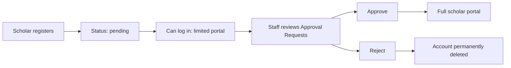
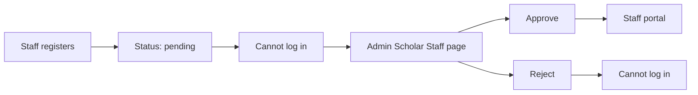
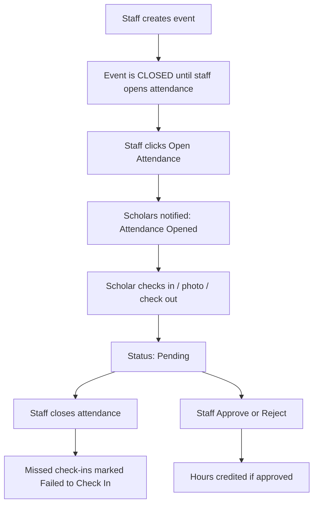
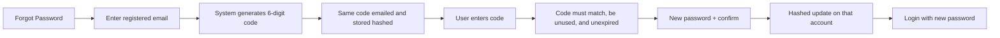
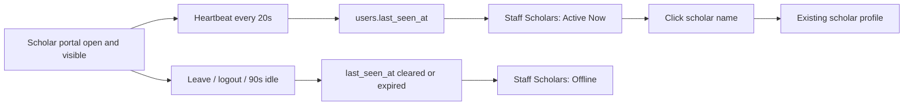

# Batang Surigaonon Scholar's App (BSSA)

<p align="center">
  
</p>

<h1 align="center">Batang Surigaonon Scholar's App</h1>

<p align="center">
  
  
  
  
</p>

A Laravel **web** application for managing the **Batang Surigaonon scholarship program**. It connects **scholars**, **scholar staff**, and **system administrators** around events, attendance, service hours, documents, approvals, and location-scoped scholarship programs (city vs province).

This README describes the **current codebase** in this repository. It is written from the routes, controllers, models, migrations, seeders, views, CSS, and configuration files that exist today.

It has two jobs:

1. **Technical documentation** for the live Laravel web system (every existing function, rule, and stylesheet).
2. **Conversion reference** for a future **React Native + Expo / Expo Go** mobile client that must keep **all** of those functions, workflows, permissions, and the **same CSS visual identity** — only the presentation layer changes.

The visual language below is taken from the live stylesheets — not a new theme.

<table>
  <tr>
    <td width="33%" bgcolor="#e7f7ef" valign="top">
      <p><strong>Scholar</strong> &nbsp; <code>/user</code></p>
      <p>Sidebar <code>#e7f7ef</code> → <code>#eaf9ef</code><br />
      Active / buttons <code>#2fa76a</code><br />
      Page <code>#f6f8fb</code> · cards white, 12px<br />
      Typeface Inter · <code>styles.css</code></p>
    </td>
    <td width="33%" bgcolor="#e8f4fc" valign="top">
      <p><strong>Scholar Staff</strong> &nbsp; <code>/staff</code></p>
      <p>Sidebar <code>#e8f4fc</code> → <code>#eef8ff</code><br />
      Active / buttons <code>#1890ff</code><br />
      Page <code>#f0f4f8</code> · cards white<br />
      <code>staff-admin.css</code></p>
    </td>
    <td width="34%" bgcolor="#fff2f1" valign="top">
      <p><strong>Admin</strong> &nbsp; <code>/admin</code></p>
      <p>Sidebar <code>#fff2f1</code><br />
      Active / buttons <code>#c2410c</code><br />
      Page <code>#faf6f5</code> · shared staff cards<br />
      <code>admin.css</code></p>
    </td>
  </tr>
</table>

---

## Table of contents

1. [Project overview](#1-project-overview)
2. [What problem it solves](#2-what-problem-it-solves)
3. [User roles and permissions](#3-user-roles-and-permissions)
4. [System workflows](#4-system-workflows)
5. [Authentication and authorization](#5-authentication-and-authorization)
6. [Features by portal](#6-features-by-portal)
7. [Notifications](#7-notifications)
8. [Backend architecture](#8-backend-architecture)
9. [Frontend architecture](#9-frontend-architecture)
10. [Visual identity (existing CSS)](#10-visual-identity-existing-css)
11. [Database](#11-database)
12. [Routes](#12-routes)
13. [Project structure](#13-project-structure)
14. [Technologies, languages, and packages](#14-technologies-languages-and-packages)
15. [System requirements](#15-system-requirements)
16. [Installation and setup](#16-installation-and-setup)
17. [Environment configuration](#17-environment-configuration) (includes [Gmail SMTP](#171-gmail-smtp-for-forgot-password))
18. [Database setup](#18-database-setup)
19. [How to run the application](#19-how-to-run-the-application)
20. [Build and production notes](#20-build-and-production-notes)
21. [Seeded administrator account](#21-seeded-administrator-account)
22. [Security features](#22-security-features)
23. [Validation and error handling](#23-validation-and-error-handling)
24. [Troubleshooting](#24-troubleshooting)
25. [Development guide](#25-development-guide)
26. [Complete function catalog](#26-complete-function-catalog)
27. [CSS files and UI component map](#27-css-files-and-ui-component-map)
28. [Expo Go / React Native conversion](#28-expo-go--react-native-conversion)
29. [CSS to React Native style translation](#29-css-to-react-native-style-translation)
30. [Mobile UI adaptation](#30-mobile-ui-adaptation)
31. [Laravel API for the mobile client](#31-laravel-api-for-the-mobile-client)
32. [Scholarship program isolation](#32-scholarship-program-isolation)

---

## 1. Project overview

**Name in the UI:** Batang Surigaonon Scholar's App  
**Code location:** this Laravel application (`composer.json` name is `laravel/laravel`; the product logic lives under `app/`, `resources/views/`, and `database/`).

The system is a **role-based scholar portal** with three portals:

| Portal | URL prefix | Who uses it |
|--------|------------|-------------|
| Scholar (user) | `/user` | Approved and pending scholars |
| Scholar Staff | `/staff` | Approved scholar staff assigned to a scholarship program |
| Administrator | `/admin` | System administrators |

The root URL `/` redirects to the login page. After login, users are sent to the dashboard that matches their role.

City Scholarship Programs and Province Scholarship Programs are stored as separate `scholarship_programs` rows and are **not mixed** in staff or admin queries. Each program has its own scholars, staff, events, attendance, documents, reports, and statistics. Scope is always `scholarship_program_id` (see [§32](#32-scholarship-program-isolation)).

Required service hours for scholars: **30** (`ScholarService::REQUIRED_HOURS`). Hours come from approved attendance records, not from hardcoded dashboard numbers.

There is **no Expo / React Native app in this repository yet**. The web Laravel app remains the source of truth. A future mobile client must call this backend and reuse the existing CSS tokens ([§10](#10-visual-identity-existing-css), [§28](#28-expo-go--react-native-conversion)).

---

## 2. What problem it solves

The application supports day-to-day scholarship operations:

- Register scholars and scholar staff against a **specific city or province program**.
- Approve or reject new accounts before they get full access.
- Publish **events**, collect **participation**, and control **attendance sessions** (open/close).
- Collect **check-in / check-out** and a **participation photo**.
- Credit **service hours** after staff approval.
- Require and review **documents** by program-specific document types.
- Track **academic year / semester** for hours and reports.
- Give administrators a **system-wide view** filtered by location and program.
- Let scholar staff see which of their program’s scholars are **currently using** the scholar portal (**Active Now**), and open a scholar’s full profile by clicking the name.

---

## 3. User roles and permissions

Roles are stored on `users.role` (`App\Models\User`):

| Constant | Value | Meaning |
|----------|--------|---------|
| `ROLE_SCHOLAR` | `scholar` | Scholar / regular user |
| `ROLE_SCHOLAR_STAFF` | `scholar_staff` | Scholar staff |
| `ROLE_ADMIN` | `admin` | Administrator |

`users.is_admin` is also used; `User::isAdmin()` is true when `is_admin` is true **or** `role` is `admin`.

Scholars, scholar staff, and administrators all live in the **same** `users` table. They are separated by `role`, not by separate databases or user tables. Numeric `users.id` values are one shared sequence.

`users.is_permanent` marks the designated administrator. `User::isPermanentAdmin()` is true when `is_permanent` is true, or when the email is `bssa_admin@gmail.com`, or when `scholar_id` is `ADMIN-001`.

Account status (`users.status`):

| Constant | Value | Typical use |
|----------|--------|-------------|
| `STATUS_PENDING` | `pending` | Waiting for approval |
| `STATUS_APPROVED` | `approved` | Active |
| `STATUS_REJECTED` | `rejected` | Denied |

### 3.1 Scholar

- **Can log in** unless status is `rejected`.
- **Pending scholars** can open Dashboard, Announcements (list + show + mark read), and Logout. They also send a presence heartbeat (`POST /user/presence`) while the scholar portal is open. Events, Calendar, Service Hours, Documents, Notifications, and Profile are blocked until staff approval (`EnsureScholarApproved` and sidebar `is-disabled` items). Announcements are **not** a sidebar item; they are opened from the dashboard and `/user/announcements`.
- **Approved scholars** get the full scholar portal listed in [§6.2](#62-scholar-portal-user), including the same presence heartbeat.
- Scholars can only see events, announcements, document types, and hours for their assigned `scholarship_program_id` (`visibleLocationIds()` / `assertEventVisibleToUser`). Calendar, Events, and dashboard upcoming lists also hide events created before `User::eventsVisibleFrom()` (`events_visible_from` on approval, otherwise `created_at`). Newly approved scholars (`events_visible_from` set) do not see completed/past events on the calendar. Event rows are not deleted.
- Scholars **cannot edit or delete** submitted attendance records. They can register, check in, check out, and upload a photo **only while staff have opened attendance** for that event (`Event::isAttendanceOpen()`).
- Must **register** for the event before check-in. Check-in is blocked if the event has ended **and** attendance is closed.
- Attendance status shown to scholars: **Pending**, **Approved**, **Rejected**, and **Failed to Check In** when applied.
- Scholars cannot approve their own hours. `POST /user/attendances/{attendance}/approve` exists but **aborts 403 unless the user is an administrator**.

### 3.2 Scholar staff

- Registration starts as **pending**. Pending and rejected staff **cannot log in** to the staff portal (`EnsureScholarStaff`, `AuthController::login`).
- **Only administrators** see pending staff registrations and can Approve or Reject them.
- Pending staff **do not appear** in “All Scholar Staff Accounts” and are not counted as active staff.
- After approval, staff can manage **only their assigned program** (`managedLocationIds()` / `coveredLocationIds()`, which is that program’s own ID — never city+province mixed).
- Staff can approve/reject **scholars**, create events, open/close attendance, approve/reject attendance hours, view attendance photos, manage document types and reviews, and run the four report pages for their program.
- On **Scholars**, staff open a scholar’s existing profile by **clicking the scholar name** (`.staff-scholar-name-link` → `GET /staff/scholars/{scholar}`). That list has no eye/view column. The profile is view-only except the existing pending **Approve** / **Reject** actions. Staff still only see scholars in their assigned program (`canManageScholar`).
- Staff **Active Now** / **Offline** on Scholars (and the scholar profile) uses `users.last_seen_at` for that program only. It is not “approved” and not `last_login_at`.
- A staff account’s **Events**, **Calendar**, **Attendance** event picker, and dashboard upcoming-event counts only include events created at or after `User::staffEventsVisibleFrom()` (`events_visible_from` when set, otherwise the staff `created_at`). Older program events stay in the `events` table for other staff, scholars, reports, and admin. `Event::scopeVisibleToStaff` applies the filter; `User::canViewStaffManagedEvent` blocks show/attendance on hidden events.
- Staff **cannot** approve other staff accounts, cannot open another program’s events (`403` on `showEvent`), and cannot review document types outside their program (`ProgramScopeService::assertDocumentTypeManagedByStaff`).
- `staff/pending-approval` exists in `web.php` but `EnsureScholarStaff` logs pending staff out at login, so that page is not reachable in normal use.

### 3.3 Administrator

- Full `/admin` portal (`EnsureAdmin`).
- Can filter most admin pages by **program type** (all / city / province) and **specific program** (`partials/admin-location-filter` — the **Viewing** form). **Locations**, **Reports**, and **Admin Settings** do not include that filter form. Those pages still show the **Current Admin Scope** banner (`partials/admin-scope-banner`). The dashboard uses its own Location & Scholarship Program dropdown.
- Approves or rejects **scholar staff** only (not scholar accounts — those are staff’s job).
- Can view scholars (click name for a view-only profile), events (click title for attendees), service hours, documents (click scholar name to preview/download that scholar’s files), and reports.
- There is **no** Admin Participation page and **no** Admin Attendance page. Staff still own participation reports and attendance sessions.
- Can manage location/program records (display name, active flag) and add locations.
- Can update their own name, email, and password.
- Can add a location (`province` or `city_municipality`) and edit `display_name` / `is_active`.
- Admin scholars list is **read-only** (search by name, email, scholar ID). Admin does **not** approve scholar accounts.
- The designated Admin account is **permanent** and cannot be deleted through the application.
- `AnnouncementService::publish()` exists for program-scoped notices, but **no staff or admin create-announcement route is wired** in `web.php`. Scholars can only list/read announcements that already exist.

---

## 4. System workflows

### 4.1 Scholar registration and approval


```mermaid
flowchart LR
  A[Scholar registers] --> B[Status: pending]
  B --> C[Can log in: limited portal]
  C --> D[Staff reviews Approval Requests]
  D --> E[Approve]
  D --> F[Reject]
  E --> G[Full scholar portal]
  F --> H[Account permanently deleted]
```

1. Scholar submits `/register` with name, scholar ID, email, password, program (city/province tree), and optional school/contact fields.
2. `User::register()` creates the account; `AccountService::provisionNewAccount()` creates document placeholders and a pending-approval notification.
3. Staff on the same program see the scholar under **Approval Requests** and **Scholars**. On **Scholars**, the name opens the scholar profile; Approval Requests still uses its view / approve / reject action buttons.
4. **Approve** sets status to `approved`, calls `User::activateFreshEventList()` (sets `events_visible_from` if null), and notifies the scholar. That scholar’s calendar starts empty of earlier program events.
5. **Reject** permanently deletes the scholar account (`AccountService::permanentlyDelete`). After a successful delete, remaining `users.id` values are compacted to `1, 2, 3, …` (`UserSequenceService`) and user foreign keys are rewritten. The designated Admin account is never deleted.

### 4.2 Scholar staff registration and approval


```mermaid
flowchart LR
  A[Staff registers] --> B[Status: pending]
  B --> C[Cannot log in]
  C --> D[Admin Scholar Staff page]
  D --> E[Approve]
  D --> F[Reject]
  E --> G[Staff portal]
  F --> H[Cannot log in]
```

1. Staff submits `/register/staff`.
2. Account is `scholar_staff` + `pending`. Admin is notified only via the admin **Scholar Staff** pending list and sidebar badge.
3. Other staff never see pending staff details.
4. Admin **Approve** sets `approved` and calls `User::activateFreshStaffEventList()` (sets `events_visible_from` to now if it is still null). Admin **Reject** sets `rejected` (account remains; login is blocked).
5. That new staff account starts with an empty Events list until an event is created after they became active. Existing staff whose `created_at` is earlier than those events still see the full program history. Event rows are not deleted.

### 4.3 Event, attendance, and service hours


```mermaid
flowchart TD
  A[Staff creates event] --> B[Event is CLOSED until staff opens attendance]
  B --> C[Staff clicks Open Attendance]
  C --> D[Scholars notified: Attendance Opened]
  D --> E[Scholar checks in / photo / check out]
  E --> F[Status: Pending]
  F --> G[Staff closes attendance]
  G --> H[Missed check-ins marked Failed to Check In]
  F --> I[Staff Approve or Reject]
  I --> J[Hours credited if approved]
```

- New events default to **attendance closed**. Event schedule times do **not** auto-open attendance.
- Staff Events (`GET /staff/events`) lists only events visible to that staff account (`visibleToStaff`). The empty table reads **No events found.** (no “Create your first event” link). **+ Add Event** stays on the filter bar.
- Staff **Open Attendance** / **Close Attendance** write timestamps, actor IDs, and `attendance_session_logs`, and notify scholars.
- While open, scholars may submit attendance. While closed, they cannot submit or change it.
- Staff approve or reject hours. Scholars see **Pending / Approved / Rejected**. Staff no longer have a free-form “Edit Attendance Record” form.
- Live status for scholars: `GET /user/attendance-status` polled about every 12 seconds (`resources/js/user-app.js`).

### 4.4 Documents

1. Staff define **document types** per scholarship program.
2. When a scholar is provisioned, placeholder `documents` rows are created (`ScholarService::ensureUserDocuments`).
3. Scholar uploads a file (stored on the `public` disk).
4. Staff review: approve, reject, or other status updates, with optional notes.
5. Admin can open a scholar’s document list and Preview/Download files. Admin does **not** change document status.

### 4.5 Forgot password (Scholar and Scholar Staff)


```mermaid
flowchart LR
  A[Forgot Password] --> B[Enter registered email]
  B --> C[System generates 6-digit code]
  C --> D[Same code emailed and stored hashed]
  D --> E[User enters code]
  E --> F[Code must match, be unused, and unexpired]
  F --> G[New password + confirm]
  G --> H[Hashed update on that account]
  H --> I[Login with new password]
```

1. Login **Forgot Password?** opens `GET /forgot-password`.
2. The email must belong to an existing **Scholar** or **Scholar Staff** account (admin emails are rejected).
3. `PasswordResetService` generates one 6-digit code (`random_int`), stores **only its hash** on `password_reset_tokens` for that email, and sends **that same plaintext code** through Gmail SMTP (`PasswordResetCodeMail`). The code is never shown on the website.
4. Verifying the code does **not** generate a new code. The typed value is compared with `Hash::check` against the stored hash.
5. Incorrect, expired (10 minutes), already-used, or locked-out codes cannot continue. After a successful verify the code is marked used (`used_at`).
6. New password rules match registration: `Password::min(8)`, confirmed. `User::updatePassword()` hashes via the existing `hashed` cast and updates **only** that email’s account.
7. Success redirects to login with a confirmation message.

Mail uses Laravel’s default mailer from `config/mail.php` / `.env`. There is no extra “SMTP is not configured” gate. If Gmail rejects the message, the unused code row is deleted and the user sees a sanitized SMTP error (the App Password is never shown).

### 4.6 Scholar presence and staff scholar profile


```mermaid
flowchart LR
  A[Scholar portal open and visible] --> B[Heartbeat every 20s]
  B --> C[users.last_seen_at]
  C --> D[Staff Scholars: Active Now]
  A --> E[Leave / logout / 90s idle]
  E --> F[last_seen_at cleared or expired]
  F --> G[Staff Scholars: Offline]
  D --> H[Click scholar name]
  H --> I[Existing scholar profile]
```

1. A logged-in scholar (pending or approved) with the scholar portal **open and visible** posts `POST /user/presence` about every 20 seconds (`User::markPresence`). Hidden tabs skip the heartbeat.
2. Closing the tab, navigating away (`pagehide` + `POST /user/presence/leave`), or **Logout** clears `last_seen_at` (`User::clearPresence`). After 90 seconds without a heartbeat (`User::PRESENCE_SECONDS`) the scholar is **Offline**.
3. Staff → Scholars (`GET /staff/scholars`) shows a green-dot **Active Now** or **Offline** beside each name. The page polls `GET /staff/scholar-presence` about every 10 seconds for scholars in `StaffDashboardService::programIds()` only.
4. Clicking the scholar name is the **only** view action on that list. It opens the same profile the old eye button used (`GET /staff/scholars/{scholar}`, `canManageScholar`). There is no Actions / eye column on Scholars. Approval Requests, Events, and the staff dashboard pending list still use their existing action buttons.
5. Approved status and `last_login_at` never imply **Active Now**. No extra user accounts are created.

---

## 5. Authentication and authorization

### Login (`AuthController`)

- Email + password; email is lowercased.
- Remember-me duration is set to **10 years** (5,256,000 minutes) in `AppServiceProvider` so inactivity does not expire the account.
- After success, `last_login_at` is updated (`User::markLogin`). That timestamp is **not** used as live presence.
- While a scholar keeps the scholar portal open and visible, `user-app.js` posts a heartbeat to `POST /user/presence` about every 20 seconds and writes `users.last_seen_at`. Closing the tab/window, navigating away (`pagehide` + `POST /user/presence/leave`), or logout clears `last_seen_at`. Staff treat a scholar as **Active Now** only when `last_seen_at` is within the last 90 seconds (`User::PRESENCE_SECONDS`).
- Redirect: admin → admin dashboard; approved staff → staff dashboard; scholar → user dashboard.
- Pending scholars see a pending-approval modal (session flag `show_pending_approval_modal`).

### Logout (`AuthController::logout`)

- Invalidates the session and regenerates the CSRF token.
- If the signed-in user is a scholar, `User::clearPresence()` runs first so staff do not keep seeing **Active Now**.

### Who can log in (`User::canLogin`)

- Admin: always (if credentials match).
- Scholar staff: only `approved`.
- Scholar: any status except `rejected`.

### Registration

- Scholar: unique email and scholar ID; password min 8 characters, confirmed.
- Staff: unique email/scholar ID rules in `assertStaffRegistrationIsUnique`; same password rules; status `pending`.
- Rate limits: login **5** attempts / 60s window; scholar register **3** / 60s; staff register **3** / 60s; forgot-password send **1** / 60s per email+IP; code verify **5** / 300s.

### Middleware aliases (`bootstrap/app.php`)

| Alias | Class | Effect |
|-------|--------|--------|
| `admin` | `EnsureAdmin` | 403 unless administrator |
| `scholar` | `EnsureScholar` | Scholar portal; rejected/staff-rejected users logged out |
| `scholar.approved` | `EnsureScholarApproved` | Pending scholars redirected to user dashboard |
| `scholar.staff` | `EnsureScholarStaff` | Staff portal; pending/rejected staff logged out |
| `scholar.staff.approved` | `EnsureScholarStaffApproved` | Staff feature routes require approved staff |

### Route-model binding (`AppServiceProvider`)

- `{staffMember}` resolves only `scholar_staff` users and **only for administrators** (others get 404).
- `{scholar}` resolves only `role = scholar` (staff cannot open a staff user via scholar URLs).

---

## 6. Features by portal

### 6.1 Public / auth pages

| Page | Route | Function |
|------|--------|----------|
| Login | `GET/POST /login` | Sign in. **Forgot Password?** goes to password recovery |
| Forgot password | `GET/POST /forgot-password` | Enter registered Scholar/Staff email; send verification code |
| Verify reset code | `GET/POST /forgot-password/verify` | Enter the exact emailed 6-digit code |
| Resend code | `POST /forgot-password/resend` | Replace the stored code and email a new one |
| New password | `GET/POST /forgot-password/reset` | After successful verify: new password + confirm |
| Scholar register | `GET/POST /register` | Create scholar account |
| Staff register | `GET/POST /register/staff` | Create pending staff account |
| Logout | `POST /logout` | End session |
| Event image | `GET /events/{event}/image` | Serve stored event image (auth required) |

### 6.2 Scholar portal (`/user`)

| Section | What it does |
|---------|----------------|
| **Dashboard** | Header is **☰ Dashboard**, then the scholar profile card (avatar + full name + menu), then **Welcome back, [name]!** and **Here's what's happening in [city], [province] — [program].**, then the current date on the right. Hour stats (approved / pending / remaining vs **30** required), upcoming events, pending attendances, announcements, recent activity, attendance OPEN/CLOSED cards, sidebar hour/calendar widgets, quick links |
| **Events** | List/select events for the scholar's program that were created after the account became active (`visibleToAccount`); confirm participation; check in; check out; upload participation photo (JPG/PNG, 5MB) while the session is open; view own photo; status badges |
| **Attendance live status** | JSON poll (~12s) for open/closed sessions and unread notification count (`#attendance-live-root`, `user-app.js`) |
| **Calendar** | Month calendar (`year` / `month`) of events created after this scholar became active. Newly approved scholars also skip completed/past events. Historical `events` rows stay for other scholars, staff, and reports |
| **Service hours** | Approved/pending/remaining hours; filter by academic year and semester (`1st Semester` / `2nd Semester`) |
| **Documents** | Upload PDF/JPG/PNG (5MB) for types in the scholar's program only; approved / pending / rejected / not submitted; download own file |
| **Notifications** | All / Unread / Important; mark one or all read; preference toggles; show 5 latest then **See More** / **Show Less** |
| **Announcements** | List, show, mark one or all read. Available to pending scholars. Not a sidebar item — opened from the dashboard or `/user/announcements` |
| **Profile & Settings** | Editable: full name, cellphone, school, course/year, year level, date of birth, guardian, academic preference. Not editable on the account tab: email, scholar ID. Password has its own form. Delete account (current password + rate limit) permanently removes the user and then compact remaining `users.id` values. The designated Admin account cannot use this action |
| **Pending modal** | First-login overlay; dismiss via `POST /user/dismiss-pending-modal` |
| **Presence heartbeat** | Hidden `#scholar-presence-root` on every scholar page (pending included). `user-app.js` posts `POST /user/presence` about every 20s while the tab is visible, and `POST /user/presence/leave` on `pagehide`. Updates `users.last_seen_at` only — not approval status and not `last_login_at` |
| **Logout** | Sidebar outline button → `POST /logout`. Scholar logout also clears `last_seen_at` |

Global academic year/semester can be updated from the scholar profile **only by an administrator** (`ProfileActionController::updateGlobalAcademicSettings`).

### 6.3 Scholar staff portal (`/staff`)

| Section | What it does |
|---------|----------------|
| **Dashboard** | Live program stats (not fake numbers): scholars, events, pending attendance, hours, documents, pending approvals, recent activity, upcoming events — all from `StaffDashboardService` + `scholarship_program_id`. Event totals and upcoming events use `visibleToStaff` for that signed-in staff account |
| **Scholars** | List scholars in the assigned program; search. The scholar name (`.staff-scholar-name-link`) is the only view action — it opens the existing profile (`GET /staff/scholars/{scholar}`, `canManageScholar`). There is no eye/view column. Beside each name: green-dot **Active Now** when that scholar’s current session heartbeat is fresh, otherwise **Offline**. Status polls `GET /staff/scholar-presence` about every 10s (no manual refresh). Presence is **not** “approved” and **not** a past login |
| **Scholar detail** | Account overview for one scholar in the same program, including the same live **Active Now** / **Offline** indicator |
| **Approval Requests** | Pending scholar registrations; **Approve** (status `approved` + notify) or **Reject** (permanent delete via `AccountService::permanentlyDelete`). This page still uses view / approve / reject action buttons (including the eye). Sidebar red badge = pending count |
| **Events** | List events visible to this staff account; **Create Event** (`title`, `description`, `location`, `starts_at`, `ends_at` after start, `service_hours` 0–999, `organizer`, JPG/PNG ≤5MB). New event `status` = `confirmed`, attendance **closed**. Notifies approved scholars in that program only. Event detail + registration count. Visibility: `created_at >= events_visible_from` (set on admin approval or approved-at-register), or `created_at >=` the staff `created_at` when that column is null. Empty table: **No events found.** Event rows are not deleted |
| **Attendance** | Per-event lists: checked in vs failed to check in; **Open / Close Attendance** with `.staff-confirm-modal`; Approve / Reject hours; view photos (`staff.attendances.photo`). No scholar-style edit-record form |
| **Documents** | CRUD document types (`name`, `description`, `required`) scoped to the staff program; provision placeholders for existing scholars; notify scholars. Review submissions: search, status filter, view, download, patch status + notes |
| **Calendar** | Staff calendar of program events (redirect target after create). Uses the same `events_visible_from` filter as Events so a new staff account does not inherit older calendar items |
| **Reports** | Four pages: service hours, attendance, participation, completion — same program IDs only |
| **Settings** | Read-only general/notification display; **Change Password** modal (current + new + confirm; `Password::min(8)->letters()->numbers()`; hashed via `User::updatePassword`; 5 attempts / 300s) |

### 6.4 Admin portal (`/admin`)

| Section | What it does |
|---------|----------------|
| **Dashboard** | Scope banner + **Location & Scholarship Program** dropdown (All Locations / All Programs, or a specific city/province program). Cards: Total Scholars, Approved Scholars, Pending Scholars, Rejected Scholars, Scholar Staff, Pending Staff, Events, Documents, Completed Scholars. Quick Actions: View Scholars, View Scholar Staff, View Events, Open Reports. Location Comparison UI and Attendance / Service Hours / Participation dashboard cards have been removed |
| **Locations** | Scope banner plus **Scholarship Program Type** switcher (`.admin-program-type-switch`): City or Province list only, never both. No Viewing filter form. **Add:** `location_name`, `location_type` (`province` \| `city_municipality`), `province_name` (required for cities), `region_name`, `display_name`. **Edit:** `display_name`, `is_active` |
| **Scholars** | Read-only list in current scope; search name / email / scholar ID. Click a scholar name (`.admin-scholar-name-link`) to open a view-only profile (`GET /admin/scholars/{scholar}`). No approve/reject here |
| **Scholar Staff** | Pending registrations (Approve → `approved` and sets `events_visible_from` for a fresh Events list; Reject → `rejected`, account kept). All Scholar Staff Accounts shows approved/rejected, **not** pending |
| **Events** | Scoped event monitoring (no create on admin). Click an event title (`.admin-event-name-link`) to open attendees (`GET /admin/events/{event}`): name, attendance status, check-in, hours |
| **Service Hours** | Scoped hours monitoring |
| **Documents** | Scoped document monitoring. Click a scholar name to open that scholar’s submissions (`GET /admin/documents/scholars/{scholar}`): type, submitted date, status, Preview/Download when a file exists. Admin does not approve/reject documents (staff still does) |
| **Reports** | Scope banner only (no Viewing filter). Summary cards: Scholars, Staff, Completed, Participation. Then **two columns**: City Scholarship Program Data (left) and Province Scholarship Program Data (right). Each column has four pies — Scholars (approved/pending/rejected), Staff (approved/pending/rejected), Completed (completed / in progress / not started), Participation (participated / pending / failed check-in; or registered if those slices are empty). **Completed** counts scholars who have met `ScholarService::REQUIRED_HOURS` (30) approved hours in the current academic period. **Participation** counts approved check-ins vs pending check-ins vs failed-check-in registrations. City and Province records are never combined in one chart. Attendance Report legend and Completion Status table have been removed |
| **Admin Settings** | Scope banner only (no Viewing filter). Update admin `full_name` / `email` (unique); change password (`Password::min(8)`, current required, session regenerate) |
| **Sidebar badge** | Polls `GET /admin/sidebar-badges` — JSON `{ staff: <pending count> }`. Red `.staff-nav-badge` only on **Scholar Staff**. Other admin keys may show `.staff-notif-badge` if a count is passed |

Admin scope is stored in session: `admin_location`, `admin_program_type`. Queries use `AdminDashboardService::resolveAdminProgramIds()`.

---

## 7. Notifications

In-app notifications use table `scholar_notifications` (`ScholarNotification`).

Typical categories used in the UI: `event_reminder`, `attendance`, `service_hours`, `documents`, `reminder`, `announcement`, `system`.

Examples of what the app writes today:

- Account pending / approved / welcome
- Staff account pending / approved / rejected
- Event published / confirmed
- Attendance opened / closed
- Participation / hours / photo / verification outcomes
- Password changed (scholar)

Scholar notification preferences (JSON on the user, `User::defaultNotificationPreferences()`): `event_reminders`, `attendance_updates`, `service_hours`, `document_updates`, `announcements` (all default `true`). Saved via `POST /user/notifications/settings`.

Unread count: `User::unreadNotificationCount()` (`is_read = false`). Shown as a red circle badge on the scholar **Notifications** nav item (hidden at 0; `99+` over 99). Live poll updates the badge.

The Notifications page loads **5** newest items first. Extra rows are in the page but hidden. **See More Notifications** / **Show Less Notifications** toggle them in the browser without deleting records.

Staff settings “Email Notifications” / “System Alerts” toggles on the staff Settings page are **display-only** (not wired to a save action).

Forgot Password sends the verification code with `PasswordResetCodeMail` over **Gmail SMTP** (`MAIL_MAILER=smtp`). In-app `scholar_notifications` still do not send email. See [§17.1](#171-gmail-smtp-for-forgot-password).

Flash messages use `partials/flash-messages.blade.php` (`success`, `error`, validation `$errors`).

---

## 8. Backend architecture

Laravel 12 MVC. There is **no** `routes/api.php` public API. A few JSON responses support the UI. When Expo is added, wrap these same controllers/services — see [§31](#31-laravel-api-for-the-mobile-client). Do not introduce a second data store.

### Controllers

| Controller | Responsibility |
|------------|----------------|
| `AuthController` | Login, register scholar/staff, logout (scholar logout also clears `last_seen_at`), rate limits |
| `PasswordResetController` | Forgot-password email, verify code, set new password |
| `UserController` | Scholar pages + attendance status JSON + presence heartbeat/leave + notification pages |
| `StaffController` | Staff pages, scholar list/profile, program-scoped presence JSON, scholar approve/reject, attendance open/close/approve/reject, password change |
| `StaffDocumentController` | Document types and file review |
| `AdminController` | Admin pages, staff approve/reject, location CRUD, scholar/event/document views, admin password |
| `EventActionController` | Scholar event register, check-in/out, photo, event image |
| `DocumentActionController` | Scholar upload/download |
| `NotificationActionController` | Mark read, settings |
| `AnnouncementActionController` | Mark announcements read |
| `ProfileActionController` | Profile, password, delete account, academic settings |

### Services

| Service | Responsibility |
|---------|----------------|
| `ScholarService` | Hours, documents, calendar, notifications, missed check-ins, activity log |
| `StaffDashboardService` | Staff/admin stats and reports scoped by program IDs |
| `AdminDashboardService` | Admin scope, staff queries, dashboard stats, City/Province report pie series |
| `AttendanceSessionService` | Open/close attendance, notify scholars, live status payload |
| `AccountService` | Provision new scholar/staff; permanent delete (blocked for the designated Admin) |
| `UserSequenceService` | After a user delete, compact remaining `users.id` to `1..n` and rewrite user foreign keys |
| `AnnouncementService` | Announcements for a user |
| `AcademicSettingsService` | Global and per-user academic year/semester; `1st Semester` / `2nd Semester` |
| `ProgramScopeService` | Program-type totals |
| `ScholarshipProgramAssignmentService` | Resolve city/province assignment on register |
| `ScholarshipProgramImportService` | Import programs from `database/data/psgc-locations.json` |
| `PasswordResetService` | Generate one reset code, email it, verify the same hash, update that account’s password |

### Models

`User`, `ScholarshipProgram`, `Event`, `EventRegistration`, `Attendance`, `AttendanceSessionLog`, `Document`, `DocumentType`, `Announcement`, `AnnouncementRead`, `ScholarNotification`, `UserActivity`, `AcademicSetting`.

Passwords use the Eloquent `hashed` cast. `User::updatePassword()` and `User::register()` set the password through that cast (not mass assignment of `password`).

Event visibility for Scholar and Scholar Staff lives on `User` (`eventsVisibleFrom`, `activateFreshEventList`, `canViewStaffManagedEvent`) and `Event::scopeVisibleToAccount` / `scopeVisibleToStaff` / `scopeUpcomingForFreshScholar`. Reports and other accounts still use the full program event set. Historical hours and attendance are not deleted.

Scholar live presence lives on `User` (`last_seen_at`, `PRESENCE_SECONDS`, `markPresence`, `clearPresence`, `isPresentNow`, `presenceLabel`). It is not `last_login_at`.

---

## 9. Frontend architecture

- **Blade** templates under `resources/views/` (`layouts/app.blade.php`, `user`, `staff`, `admin`, `auth`).
- **Vite** bundles `resources/css/styles.css`, `resources/css/app.css`, `resources/js/app.js`, `resources/js/user-app.js` (sidebar, attendance poll ~12s, scholar presence heartbeat ~20s, staff scholar-presence poll ~10s, avatar preview).
- **Tailwind CSS v4** is in the Vite pipeline (`@tailwindcss/vite`). Most staff/admin UI is custom CSS in `public/css/staff-admin.css` and `public/css/admin.css`.
- Scholar UI: `resources/css/styles.css` plus page CSS (`notifications-page.css`, `dashboard-events.css`, `documents-page.css`, `profile-page.css`, `service-hours-page.css`, `pending-approval-modal.css`, `user-nav.css`).
- Static JS: `public/js/notifications-toggle.js` plus inline scripts on some pages (staff password modal, admin dashboard selector).

Layouts:

- `layouts.app` — HTML shell, Inter font, Vite styles.
- `layouts.user` — scholar sidebar + topbar + scholar presence root + attendance live root.
- `layouts.staff` — staff sidebar + topbar + confirm modal. Scholars and scholar-profile pages also mount `#staff-scholar-presence-root`.
- `layouts.admin` — admin sidebar + topbar + staff-badge poll.

Scholar pages use white `.card` blocks (12px radius, light shadow), green `.btn` fills, outline green buttons, and uppercase 12px `.card-header` labels. Staff/admin pages use `.staff-card`, `.staff-btn` / `.staff-btn-primary`, `.staff-table`, and `.staff-stat-card` from `staff-admin.css`, with admin recoloring those tokens in `admin.css`.

---

## 10. Visual identity (existing CSS)

This documentation follows the **same tokens the app already uses**. Do not introduce a separate brand for docs or new screens.

### Scholar portal — `resources/css/styles.css`

```css
:root {
    --green: #2fa76a;
    --green-2: #e7f7ef;
    --muted: #8a8f98;
    --card-bg: #ffffff;
    --radius: 12px;
    --shadow: 0 6px 18px rgba(24, 39, 75, 0.06);
}
```

| Token / class | Value in the app |
|---------------|------------------|
| Page background | `#f6f8fb` |
| Body text | `#1f2937` |
| Typeface | **Inter** (300–800), loaded in `layouts/app.blade.php` |
| Sidebar | Gradient `#e7f7ef` → `#eaf9ef`; active nav `#2fa76a` + white text |
| Logo mark | Gradient `#0ea96d` → `#2fa76a`, 12px radius |
| Cards | White, 12px radius, `--shadow` |
| Primary button `.btn` | `#2fa76a` fill, white text, 8px radius |
| Outline button `.btn.outline` | Transparent fill, `#2fa76a` border |
| Program badge | White card, `#b6ebb9` border, `#166534` text |
| Notification badge `.nav-notif-badge` | `#ef4444` pill, white count (`user-nav.css` + `styles.css`) |
| Status badges | Pending `#c27a00`; approved green; rejected `#fee2e2` / `#dc2626` |

### Scholar staff portal — `public/css/staff-admin.css`

| Token | Value |
|-------|--------|
| `--staff-sidebar` | `#e8f4fc` (staff drawer also uses gradient `#e8f4fc` → `#eef8ff`) |
| `--staff-sidebar-text` | `#0b2d4d` |
| `--staff-sidebar-active` / `--staff-primary` | `#1890ff` |
| `--staff-bg` | `#f0f4f8` |
| `--staff-card` | `#ffffff` |
| `--staff-border` | `#e5e7eb` |
| `--staff-text` | `#1f2937` |
| `--staff-muted` | `#6b7280` |

Primary staff actions use `.staff-btn-primary` (blue `#1890ff`). Confirm dialogs use the existing `.staff-confirm-modal`: white `.staff-confirm-dialog` (16px radius), backdrop `rgba(15, 39, 68, 0.45)`.

### Admin portal — `public/css/admin.css`

Admin **reuses** staff components and only overrides colors:

| Token | Value |
|-------|--------|
| `--admin-sidebar` | `#fff2f1` |
| `--admin-sidebar-text` | `#5c1a14` |
| `--admin-sidebar-active` / `--admin-primary` | `#c2410c` |
| Page background | `#faf6f5` |
| Location banner / pills | `#fff2f1` fill, `#f5d0c8` border |
| Scholar / event name links | `.admin-scholar-name-link`, `.admin-event-name-link` — underlined `#c2410c` |
| Locations type switcher | `.admin-program-type-switch` / `.admin-program-type-btn` |
| Reports split | `.admin-report-program-split` two columns (City left, Province right); stacks under 700px. Each column `.admin-report-pies` lists four `.admin-pie-card` charts |

### UI patterns to keep

- **Navigation:** rounded 10px items; active item is a solid brand color (green / blue / orange).
- **Cards:** white surface, 12px corners, light border or shadow — not heavy drop shadows.
- **Tables:** `.staff-table` on staff/admin; compact headers, muted secondary text. Staff scholar lists (Approval Requests, Scholars, document/event scholar rows) add `.staff-stack-table` so each row becomes a card under 800px: label above value, scholar name/ID wrap inside the card, no horizontal clip. On **Scholars**, the name (`.staff-scholar-name-link`, underlined `#1890ff`, hover `#096dd9`) is the view action.
- **Spacing:** 16–24px gaps between cards (`gap` / `margin-bottom` already used in the CSS).
- **Badges:** pill (`border-radius: 999px`) for counts and OPEN/CLOSED attendance.
- **Scholar presence:** `.staff-presence` beside the scholar name — green `#22c55e` dot + `#15803d` **Active Now**, or gray `#9ca3af` / `#6b7280` **Offline**.

When adding README screenshots or UI notes, use these hex values. Do not switch the scholar portal to staff blue or admin orange.

### CSS files and what they style

| File | Loaded from | Styles |
|------|-------------|--------|
| `resources/css/styles.css` | `layouts/app.blade.php` via Vite | Scholar shell: `:root` tokens, sidebar, nav, cards, buttons, tables, badges, forms, calendar, auth pages, alerts, dashboard widgets |
| `resources/css/app.css` | Laravel welcome / Vite default | Tailwind entry — **not** the scholar/staff/admin product UI |
| `public/css/user-nav.css` | `layouts/user.blade.php` (`?v=filemtime`) | Nav row + `.nav-notif-badge` (`#ef4444` pill); stacked scholar `.topbar` / `.topbar-dashboard` (title, profile card, welcome, date) |
| `public/css/pending-approval-modal.css` | User layout (pending) + staff pending view | Centered 16px white panel, `rgba(15, 39, 68, 0.45)` backdrop, amber icon `#fef3c7` / `#d97706` |
| `public/css/dashboard-events.css` | `user/dashboard.blade.php` | Upcoming-event row grid (date / thumb / details / action) |
| `public/css/attendance-photo.css` | Events + calendar | Dashed 12px drop zone `#d1d5db`, preview 10px radius, rejected note `#b91c1c` |
| `public/css/service-hours-page.css` | `user/service-hours.blade.php` | Main + 340px sticky sidebar, 20px gap, charts |
| `public/css/documents-page.css` | `user/documents.blade.php` | Main + 320px sidebar, 24px gap |
| `public/css/notifications-page.css` | `user/notifications.blade.php` | Main + 320px settings column; hidden extra items |
| `public/css/profile-page.css` | `user/profile.blade.php` | Section cards 20px padding, 24px stack, sidebar help |
| `public/css/staff-admin.css` | Staff + admin layouts (`?v=filemtime`) | Staff tokens, `.staff-sidebar`, `.staff-nav-item`, `.staff-card`, `.staff-stat-card`, `.staff-table`, `.staff-stack-table` (mobile card rows), `.staff-scholar-name-link`, `.staff-presence` / `.staff-presence-dot` (Active Now / Offline), `.staff-btn`, filters, confirm modal, stacked staff header |
| `public/css/admin.css` | Admin layout **after** staff-admin | Recolors staff tokens to orange/peach; location banner/pills; name links; report pies; locations type switcher |

### Scholar component tokens (from `styles.css`)

| Component | Classes / rules |
|-----------|-----------------|
| **Typography** | Inter 300–800; title 14px/700 `#0f1721`; topbar `h1` 26px; card headers 12px uppercase 0.3px tracking; muted `#8a8f98` |
| **Sidebar** | 300px; gradient `#e7f7ef` → `#eaf9ef`; padding 28×20; gap 20px; collapsible `.sidebar.collapsed` |
| **Nav** | `.nav-item` 12×14 padding, 10px radius, weight 600; `.active` fill `#2fa76a` + white + `--shadow`; disabled pending items are `<span class="nav-item is-disabled">` |
| **Header / topbar** | Scholar shell (`user-nav.css`): stacked `.topbar` — hamburger + page title, then full-width `.profile-card` (avatar, wrapping name, dropdown). On Dashboard only (`.topbar-dashboard`): **Welcome back, [name]!**, **Here's what's happening in [city], [province] — [program].**, then `.topbar-date` right-aligned (`F j, Y`). Names and program text wrap; no ellipsis cutoff |
| **Cards** | `.card` white, 12px radius, 16px padding, `--shadow` |
| **Buttons** | `.btn` green 8px radius; `.btn.outline` green border; `.btn.small`; `.btn.full`; `.btn.blue` `#2563eb`; `.btn.danger` red outline |
| **Forms** | `.form-grid` 2-col 16px gap; labels 12px uppercase muted; inputs 12×14, 8px radius, `#e6eef0` border, `#f9fafb` fill; focus border `--green`; disabled `#f3f4f6` |
| **Tables** | `.table` collapse; th muted 13px; td 12px + `#f1f5f9` top border |
| **Badges** | 8px radius (or pill 999px); pending `#fff4e6`/`#c27a00`; confirmed green; rejected `#fee2e2`/`#dc2626`; open `#dcfce7`/`#166534`; closed gray |
| **Alerts** | Success `#d4f7db`/`#b6ebb9`/`#155724`; error `#fee2e2`/`#fecaca`/`#dc2626`; 8px radius |
| **Modals** | Pending-approval: 16px white panel, 480px max, amber icon |

### Staff / admin components (from `staff-admin.css` + `admin.css`)

| Component | Classes / rules |
|-----------|-----------------|
| **Sidebar** | `.staff-sidebar`; staff `#e8f4fc` → `#eef8ff` text `#0b2d4d`; admin `#fff2f1` text `#5c1a14` |
| **Nav** | `.staff-nav-item` 10px radius; hover translucent white (staff) or `rgba(194, 65, 12, 0.08)` (admin); `.active` solid primary + white |
| **Stat cards** | `.staff-stat-grid` 5 columns 16px gap; `.staff-stat-card` white, 12px, 1px `#e5e7eb`, light shadow; icon 42px / 10px radius (blue/green/orange/purple/teal/red/gray) |
| **Cards** | `.staff-card` 20px padding, 12px radius, 1px border |
| **Buttons** | `.staff-btn` 8px; `.staff-btn-primary` fill `--staff-primary` (blue or admin orange) |
| **Tables** | `.staff-table-wrap` horizontal scroll on desktop; `.staff-table` 14px. Under 800px, `.staff-stack-table` / `.staff-scholars-table` hide `thead` and stack each row as a card: label above value, scholar name/ID wrap. Staff Scholars uses the name link instead of an Actions column |
| **Filters** | `.staff-filter-bar` white 12px card; `.staff-search` `#f9fafb` 8px |
| **Confirm modal** | `.staff-confirm-modal` / `.staff-confirm-dialog` 16px, backdrop `rgba(15, 39, 68, 0.45)` |
| **Staff name links** | `.staff-scholar-name-link` — underlined `--staff-primary` `#1890ff`, hover `#096dd9`; opens `staff.scholars.show` |
| **Admin name links** | `.admin-scholar-name-link`, `.admin-event-name-link` |
| **Admin reports** | `.admin-report-program-split`, `.admin-report-pies`, `.admin-pie-card` |

Page layouts that a mobile port must preserve (same data, stacked on small screens): notifications/documents **1fr + 320px**; service hours **1fr + 340px**; staff dashboard **5-stat row** then **2fr / 1fr** grids.

---

## 11. Database

**Default connection in `.env.example`:** SQLite (`DB_CONNECTION=sqlite`). MySQL variables are present but commented out.

**Session, cache, and queue** in `.env.example`: `database` driver.

### Tables (from migrations)

| Table | Purpose |
|-------|---------|
| `users` | One table for scholars, scholar staff, and admin (`role` separates them) |
| `password_reset_tokens` | Forgot-password codes: email, hashed code (`token`), `created_at`, `used_at`, `attempts` |
| `sessions` | Database sessions |
| `cache`, `cache_locks` | Cache |
| `jobs`, `job_batches`, `failed_jobs` | Queue |
| `scholarship_programs` | City/province programs (PSGC fields, type, names) |
| `events` | Events + attendance session columns + `image_path` |
| `event_registrations` | Scholar ↔ event |
| `attendances` | Check-in/out, hours, status, photo, academic period |
| `attendance_session_logs` | Open/close audit |
| `document_types` | Required docs per program |
| `documents` | Uploads and review |
| `announcements` | Notices (optional program + announcement reads) |
| `announcement_reads` | Read receipts |
| `scholar_notifications` | In-app notifications (`announcement_id`, `event_id`) |
| `user_activities` | Activity feed |
| `academic_settings` | Global year/semester |

### Important `users` fields

`full_name`, `scholar_id`, `email`, `password`, `role`, `is_admin`, `is_permanent`, `status`, `scholarship_program_id`, `city`, `province`, school/contact/guardian fields, `notification_preferences`, `academic_year_start`, `semester`, `last_login_at`, `last_seen_at`, `events_visible_from`, `avatar_path`.

`last_seen_at` is **not** mass-assignable. Migration `2026_09_23_000003_add_last_seen_at_to_users` adds the nullable timestamp. Scholar heartbeats (`User::markPresence`) write it; logout / leave (`User::clearPresence`) null it. Staff **Active Now** requires `last_seen_at` within `User::PRESENCE_SECONDS` (90). Approved status and `last_login_at` never imply online.

`is_permanent` is **not** mass-assignable. Migration `2026_09_23_000001_add_is_permanent_to_users` adds the column and marks the seeded Admin row.

`events_visible_from` is **not** mass-assignable. Migration `2026_09_23_000002_add_events_visible_from_to_users` adds the nullable timestamp. It is set when a Scholar or Scholar Staff account is created already approved, when staff approve a pending scholar (`User::activateFreshEventList()`), or when an administrator approves pending staff. Calendars and event lists use that timestamp, or `users.created_at` when it is null. Older program events stay in the `events` table.

After `AccountService::permanentlyDelete()` succeeds, `UserSequenceService` renumbers remaining users to sequential IDs (`1, 2, 3, …`) and updates these user references only: `event_registrations.user_id`, `attendances.user_id`, `documents.user_id`, `documents.reviewed_by`, `user_activities.user_id`, `scholar_notifications.user_id`, `announcement_reads.user_id`, `attendance_session_logs.staff_id`, `events.attendance_opened_by`, `events.attendance_closed_by`, `academic_settings.updated_by`, `sessions.user_id`. Other tables’ own primary keys are not compacted. The next insert uses `AUTO_INCREMENT = max(id) + 1`.

### Attendance statuses (`Attendance`)

`pending`, `approved`, `rejected`, `failed_to_check_in`.

### Relationships (high level)

- Program `hasMany` users (scholars / approved staff), events, announcements.
- User `hasMany` attendances, documents, notifications, activities, registrations.
- Event `hasMany` attendances, registrations, session logs.
- Document `belongsTo` user and document type.

### Seeders

- `ScholarshipProgramSeeder` — imports nationwide locations via `ScholarshipProgramImportService` from `database/data/psgc-locations.json`.
- `AdminSeeder` — creates/updates the administrator user and sets `is_permanent` (see [§21](#21-seeded-administrator-account)).
- `DatabaseSeeder` — runs both seeders, then creates current `academic_settings` (this year → next year, `2nd Semester`).

### Factories

`UserFactory` exists for tests/factories. Feature tests in `tests/` are still Laravel example tests, not product coverage.

---

## 12. Routes

All application routes are in `routes/web.php`. Health check: `GET /up`.

Named routes use prefixes `admin.*`, `staff.*`, `user.*`.

### Scholar routes (`auth` + `scholar`; approved group noted)

| Method | Path | Name | Access |
|--------|------|------|--------|
| GET | `/user/dashboard` | `user.dashboard` | Scholar including pending |
| POST | `/user/presence` | `user.presence` | Scholar including pending (heartbeat) |
| POST | `/user/presence/leave` | `user.presence.leave` | Scholar including pending (tab close / leave) |
| POST | `/user/dismiss-pending-modal` | `user.dismiss-pending-modal` | Scholar including pending |
| GET | `/user/announcements` | `user.announcements` | Scholar including pending |
| GET | `/user/announcements/{announcement}` | `user.announcements.show` | Scholar including pending |
| POST | `/user/announcements/read-all` | `user.announcements.read-all` | Scholar including pending |
| POST | `/user/announcements/{announcement}/read` | `user.announcements.read` | Scholar including pending |
| GET | `/user/events` | `user.events` | Approved |
| GET | `/user/attendance-status` | `user.attendance.status` | Approved (JSON) |
| GET | `/user/calendar` | `user.calendar` | Approved |
| GET | `/user/service-hours` | `user.service-hours` | Approved |
| GET | `/user/documents` | `user.documents` | Approved |
| GET | `/user/notifications` | `user.notifications` | Approved |
| GET | `/user/notifications/more` | `user.notifications.more` | Approved |
| GET | `/user/profile` | `user.profile` | Approved |
| POST | `/user/events/{event}/register` | `user.events.register` | Approved |
| POST | `/user/events/{event}/check-in` | `user.events.check-in` | Approved + session open |
| POST | `/user/events/{event}/check-out` | `user.events.check-out` | Approved + session open |
| POST | `/user/events/{event}/photo` | `user.events.photo` | Approved + session open |
| GET | `/user/attendances/{attendance}/photo` | `user.attendances.photo` | Owner only |
| POST | `/user/attendances/{attendance}/approve` | `user.attendances.approve` | **Admin only** (403 otherwise) |
| POST | `/user/documents/upload` | `user.documents.upload` | Approved; type must match program |
| GET | `/user/documents/{document}/download` | `user.documents.download` | Owner only |
| POST | `/user/notifications/{notification}/read` | `user.notifications.read` | Owner only |
| POST | `/user/notifications/read-all` | `user.notifications.read-all` | Approved |
| POST | `/user/notifications/settings` | `user.notifications.settings` | Approved |
| PUT | `/user/profile` | `user.profile.update` | Approved |
| PUT | `/user/profile/guardian` | `user.profile.guardian` | Approved |
| PUT | `/user/profile/academic` | `user.profile.academic` | Approved |
| PUT | `/user/profile/academic/global` | `user.profile.academic.global` | Admin only |
| PUT | `/user/profile/password` | `user.profile.password` | Approved |
| DELETE | `/user/profile` | `user.profile.destroy` | Approved |

### Staff routes (`auth` + `scholar.staff`; most need `scholar.staff.approved`)

| Method | Path | Name |
|--------|------|------|
| GET | `/staff/dashboard` | `staff.dashboard` |
| GET | `/staff/scholars` | `staff.scholars` |
| GET | `/staff/scholar-presence` | `staff.scholars.presence` |
| GET | `/staff/scholars/{scholar}` | `staff.scholars.show` |
| POST | `/staff/scholars/{scholar}/approve` | `staff.scholars.approve` |
| POST | `/staff/scholars/{scholar}/reject` | `staff.scholars.reject` |
| GET | `/staff/approval-requests` | `staff.approval-requests` |
| GET/POST | `/staff/events`, `/staff/events/create` | `staff.events`, `staff.events.create`, `staff.events.store` |
| GET | `/staff/events/{event}` | `staff.events.show` |
| GET | `/staff/attendance` | `staff.attendance` |
| POST | `/staff/events/{event}/attendance/open` | `staff.attendance.open` |
| POST | `/staff/events/{event}/attendance/close` | `staff.attendance.close` |
| GET | `/staff/attendances/{attendance}/photo` | `staff.attendances.photo` |
| POST | `/staff/attendances/{attendance}/approve` | `staff.attendances.approve` |
| POST | `/staff/attendances/{attendance}/reject` | `staff.attendances.reject` |
| GET/POST | `/staff/documents` … | types CRUD + `view` / `download` / `status` |
| GET | `/staff/calendar` | `staff.calendar` |
| GET | `/staff/settings` | `staff.settings` |
| PUT | `/staff/settings/password` | `staff.settings.password` |
| GET | `/staff/reports/{service-hours\|attendance\|participation\|completion}` | `staff.reports.*` |

### Admin routes (`auth` + `admin`)

| Method | Path | Name |
|--------|------|------|
| GET | `/admin/dashboard` | `admin.dashboard` |
| GET | `/admin/sidebar-badges` | `admin.sidebar-badges` |
| GET/POST | `/admin/locations` | `admin.locations`, `admin.locations.store` |
| GET/PUT | `/admin/locations/{location}` | `admin.locations.edit`, `admin.locations.update` |
| GET | `/admin/scholars` | `admin.scholars` |
| GET | `/admin/scholars/{scholar}` | `admin.scholars.show` |
| GET | `/admin/staff` | `admin.staff` |
| POST | `/admin/staff/{staffMember}/approve` | `admin.staff.approve` |
| POST | `/admin/staff/{staffMember}/reject` | `admin.staff.reject` |
| GET | `/admin/events` | `admin.events` |
| GET | `/admin/events/{event}` | `admin.events.show` |
| GET | `/admin/service-hours` | `admin.service-hours` |
| GET | `/admin/documents` | `admin.documents` |
| GET | `/admin/documents/scholars/{scholar}` | `admin.documents.scholar` |
| GET | `/admin/documents/{document}/view` | `admin.documents.view` |
| GET | `/admin/documents/{document}/download` | `admin.documents.download` |
| GET | `/admin/reports` | `admin.reports` |
| GET/PUT | `/admin/settings` | `admin.settings`, `admin.settings.update` |
| PUT | `/admin/settings/password` | `admin.settings.password` |

Also: `GET /` → login; `GET /dashboard` role redirect; `GET /up` health.

### Public password recovery (`guest`)

| Method | Path | Name |
|--------|------|------|
| GET | `/forgot-password` | `password.request` |
| POST | `/forgot-password` | `password.email` |
| GET | `/forgot-password/verify` | `password.verify` |
| POST | `/forgot-password/verify` | `password.verify.post` |
| POST | `/forgot-password/resend` | `password.resend` |
| GET | `/forgot-password/reset` | `password.reset` |
| POST | `/forgot-password/reset` | `password.update` |

### JSON / XHR used by the UI

| Method | Path | Name | Purpose |
|--------|------|------|---------|
| GET | `/admin/sidebar-badges` | `admin.sidebar-badges` | Pending staff count |
| GET | `/user/attendance-status` | `user.attendance.status` | Live attendance + unread count |
| POST | `/user/presence` | `user.presence` | Scholar heartbeat → `last_seen_at` |
| POST | `/user/presence/leave` | `user.presence.leave` | Clear scholar `last_seen_at` |
| GET | `/staff/scholar-presence` | `staff.scholars.presence` | Program-scoped Active Now / Offline map |
| GET | `/user/notifications/more` | `user.notifications.more` | Extra notification HTML (optional; page also embeds extras) |

There is no versioned REST API for third-party clients.

---

## 13. Project structure

```
scholar/
├── app/
│   ├── Http/Controllers/     # HTTP entry points
│   ├── Http/Middleware/      # Role and approval gates
│   ├── Models/               # Eloquent models
│   ├── Providers/            # AppServiceProvider (auth duration, route binds)
│   └── Services/             # Domain logic
├── bootstrap/app.php         # Middleware aliases, routing
├── config/                   # Laravel config (filesystems, auth, database, …)
├── database/
│   ├── data/psgc-locations.json
│   ├── migrations/
│   ├── seeders/
│   └── factories/
├── public/                   # Web root (index.php, css/, js/)
├── resources/
│   ├── css/                  # Vite CSS
│   ├── js/                   # user-app.js (sidebar, attendance poll, presence heartbeat/poll, badge)
│   └── views/                # Blade
├── routes/web.php
├── storage/                  # logs, compiled views, app/public uploads
├── tests/
├── artisan
├── composer.json
├── package.json
├── vite.config.js
└── .env.example
```

Uploads used by the app:

- Event images: public disk, `event_images/`
- Attendance photos: public disk, `attendance_photos/{user_id}/`
- Documents: public disk, `documents/{user_id}/`

`php artisan storage:link` is required so `/storage/...` can be served.

---

## 14. Technologies, languages, and packages

### Languages

| Language | Where |
|----------|--------|
| PHP 8.2+ | Backend |
| Blade | Views |
| JavaScript | Vite bundle + `public/js` |
| CSS | Vite + `public/css` |
| SQL | Via Laravel migrations (SQLite or other configured driver) |
| JSON | PSGC location import |

### Frameworks and tools (from lock/manifest files)

**PHP (`composer.json` / `composer.lock`):**

| Package | Constraint / locked |
|---------|---------------------|
| `laravel/framework` | `^12.0` / **v12.62.0** |
| `laravel/tinker` | `^2.10.1` |
| `laravel/pint` | `^1.24` (dev) |
| `laravel/sail` | `^1.41` (dev) |
| `laravel/pail` | `^1.2.2` (dev) |
| `phpunit/phpunit` | `^11.5.50` (dev) |
| `fakerphp/faker` | `^1.23` (dev) |
| `mockery/mockery` | `^1.6` (dev) |
| `nunomaduro/collision` | `^8.6` (dev) |

**JavaScript (`package.json`):**

| Package | Version |
|---------|---------|
| `vite` | `^7.0.7` |
| `laravel-vite-plugin` | `^2.0.0` |
| `tailwindcss` | `^4.0.0` |
| `@tailwindcss/vite` | `^4.0.0` |
| `axios` | `^1.11.0` |
| `concurrently` | `^9.0.1` |

**Other runtime pieces**

- Laravel Eloquent ORM, Blade, Vite, session/cache/queue on the database by default.
- Font: Inter (Google Fonts) in `layouts/app.blade.php`.
- Avatar placeholders: `ui-avatars.com` in some sidebars.

---

## 15. System requirements

- PHP **8.2 or newer** with common Laravel extensions (openssl, pdo, mbstring, tokenizer, xml, ctype, json, fileinfo)
- Composer 2
- Node.js + npm (for Vite)
- SQLite (default) **or** another database if you change `.env`
- Ability to create `public/storage` → `storage/app/public`

---

## 16. Installation and setup

From the application directory (the folder that contains `artisan`):

```bash
composer install
copy .env.example .env
php artisan key:generate
```

On macOS/Linux use `cp .env.example .env` instead of `copy`.

```bash
php artisan migrate --force
php artisan db:seed
php artisan storage:link
npm install
npm run build
```

One-shot Composer script (installs deps, copies `.env` if missing, key, migrate, npm install + build):

```bash
composer setup
```

`composer setup` does **not** run `db:seed` or `storage:link`. Run those separately.

---

## 17. Environment configuration

Copy `.env.example` to `.env`. Do not commit `.env`.

Relevant keys from `.env.example`:

| Variable | Role |
|----------|------|
| `APP_NAME`, `APP_ENV`, `APP_KEY`, `APP_DEBUG`, `APP_URL` | App identity and URL |
| `APP_TIMEZONE` | Default `Asia/Manila` |
| `APP_LOCALE` | `en` |
| `DB_CONNECTION` | Default `sqlite` |
| `SESSION_DRIVER` | `database`; `SESSION_LIFETIME=5256000` |
| `QUEUE_CONNECTION` | `database` |
| `CACHE_STORE` | `database` |
| `FILESYSTEM_DISK` | `local` (uploads still use the `public` disk in code) |
| `MAIL_*` | Gmail SMTP for Forgot Password codes. See [§17.1](#171-gmail-smtp-for-forgot-password) |
| `VITE_APP_NAME` | Exposed to Vite |

If you use SQLite, ensure `database/database.sqlite` exists (Laravel’s create-project script can create it; otherwise `touch database/database.sqlite` or create the file manually).

If you switch to MySQL, uncomment and set `DB_HOST`, `DB_PORT`, `DB_DATABASE`, `DB_USERNAME`, `DB_PASSWORD`.

### 17.1 Gmail SMTP for Forgot Password

Forgot Password delivers a 6-digit verification code to the scholar or staff member’s registered Gmail/email. The app sends that mail through **one sending Gmail account** configured in `.env`. Do **not** put the App Password in Blade, JavaScript, controllers, the database, or git.

`.env` is gitignored. `.env.example` contains placeholders only.

**Required `.env` variables**

```env
MAIL_MAILER=smtp
MAIL_HOST=smtp.gmail.com
MAIL_PORT=587
MAIL_USERNAME=your-sending-gmail@gmail.com
MAIL_PASSWORD=your-google-app-password
MAIL_ENCRYPTION=tls
MAIL_FROM_ADDRESS=your-sending-gmail@gmail.com
MAIL_FROM_NAME="${APP_NAME}"
```

`MAIL_SCHEME=smtp` is optional. Laravel maps `MAIL_ENCRYPTION=tls` (port 587) to STARTTLS, and `ssl` to `smtps` (port 465). `config/mail.php` reads these from `.env`; nothing is hardcoded.

**Setup**

1. Choose a Gmail account that will **send** BSSA mail (this can be a project address such as `bssa.mail@gmail.com`). This is not the scholar’s inbox; it is the From address.
2. On that Gmail account, turn on **2-Step Verification**: Google Account → Security → 2-Step Verification.
3. Generate a **Google App Password**: Google Account → Security → 2-Step Verification → App passwords → Mail / Other → generate. Copy the 16-character password (spaces optional).
4. Put that App Password in `.env` as `MAIL_PASSWORD`. Do **not** use the normal Gmail login password. Google will reject SMTP if you do.
5. Set `MAIL_USERNAME` and `MAIL_FROM_ADDRESS` to the **same** sending Gmail address.
6. Keep `MAIL_MAILER=smtp`, `MAIL_HOST=smtp.gmail.com`, `MAIL_PORT=587`, and `MAIL_ENCRYPTION=tls`.
7. After any `.env` mail change, clear cached config:

```bash
php artisan config:clear
php artisan cache:clear
```

8. Test with a **real registered Scholar or Scholar Staff** Gmail:
   - Login → **Forgot Password?**
   - Enter that account’s registration email
   - Open Gmail (and Spam) for *Your BSSA password reset verification code*
   - Type the **same** 6 digits into Verification Code
   - Set New Password / Confirm New Password and log in

The typed code is checked against the hash stored for **that email only**. A different code is not generated at verify time. Wrong, expired (10 minutes), or already-used codes cannot change the password.

**Do not**

- Commit `.env` or paste App Passwords into the README, chat, or frontend
- Store the Gmail password or App Password in the database
- Display the verification code on the website
- Use `MAIL_MAILER=log` in production (that writes mail to `storage/logs/laravel.log` instead of Gmail)

---

## 18. Database setup

```bash
php artisan migrate
php artisan db:seed
```

Refresh (destroys data):

```bash
php artisan migrate:fresh --seed
```

---

## 19. How to run the application

**PHP server only** (use built Vite assets from `npm run build`):

```bash
php artisan serve
```

Open `http://127.0.0.1:8000` on this computer.

**On the local network** (phones, tablets, other laptops):

```bash
php artisan serve --host=0.0.0.0 --port=8000
```

Artisan prints this computer’s LAN IPv4 address (for example `http://192.168.1.5:8000`). Open **that** URL in the other device’s browser. Do not open `http://0.0.0.0:8000` — browsers cannot use `0.0.0.0` as a destination.

Allow TCP port **8000** (and **5173** if you also run `npm run dev`) through Windows Firewall. From an **Administrator** PowerShell:

```powershell
netsh advfirewall firewall add rule name="BSSA Laravel HTTP 8000" dir=in action=allow protocol=TCP localport=8000 profile=private,domain
netsh advfirewall firewall add rule name="BSSA Vite 5173" dir=in action=allow protocol=TCP localport=5173 profile=private,domain
```

`APP_URL` stays `http://127.0.0.1:8000` for Artisan/CLI. Page links and assets follow the host in the browser (localhost or the LAN IP).

**Full local stack** (server + queue listener + pail logs + Vite):

```bash
composer dev
```

Or separately:

```bash
php artisan serve --host=0.0.0.0 --port=8000
php artisan queue:listen --tries=1 --timeout=0
npm run dev
```

Log in at `/login`. Register scholars at `/register` and staff at `/register/staff`.

The UI you see is the existing web design: scholar green sidebar (`#2fa76a`), staff blue sidebar (`#e8f4fc` / `#1890ff`), admin peach/orange sidebar (`#fff2f1` / `#c2410c`).

### Mobile / Expo Go (current repo)

This repository is a **Laravel web application only**. There is no Expo, React Native, or `app.json` project in the tree today, so **Expo Go cannot load this app yet**.

Scholars, staff, and admins use a browser (desktop or mobile web). To try the **existing web CSS** on a phone, run `php artisan serve --host=0.0.0.0 --port=8000` and open the **Network** URL Artisan prints (for example `http://192.168.1.5:8000`) in the phone browser on the same Wi-Fi.

A future native client must follow [§28](#28-expo-go--react-native-conversion)–[§31](#31-laravel-api-for-the-mobile-client): same functions, same Laravel database, same design tokens. Do not ship a simplified Expo demo with hardcoded scholars, events, or stats.

---

## 20. Build and production notes

```bash
npm run build
php artisan config:cache
php artisan route:cache
php artisan view:cache
```

Point the web server document root to `public/`. Keep `APP_DEBUG=false` in production. Run `php artisan storage:link` on the server. Set a strong `APP_KEY` and database credentials. Change the seeded administrator password immediately.

Laravel Sail is listed as a Composer dev dependency; this README does not assume a Sail-specific deploy unless you add one.

---

## 21. Seeded administrator account

`AdminSeeder` creates or updates an administrator with:

- **Email:** `bssa_admin@gmail.com`
- **Name:** BSSA Administrator
- **Scholar ID:** `ADMIN-001`
- **Role:** admin, approved
- **Permanent:** `is_permanent = true`

This designated Admin account cannot be deleted through the application (`User::isPermanentAdmin()`, `AccountService::permanentlyDelete`, profile delete). Changing the email in Admin Settings does not drop that protection: the model also treats `bssa_admin@gmail.com` and `ADMIN-001` as permanent.

The initial password is defined in `database/seeders/AdminSeeder.php`. **Do not publish that password.** Change it after first login via **Admin Settings → Change Password**.

No other demo scholar or staff passwords are defined in seeders.

---

## 22. Security features

- Passwords hashed with Laravel’s `hashed` cast (bcrypt; `BCRYPT_ROUNDS=12` in `.env.example`).
- CSRF tokens on forms (`@csrf`).
- Role middleware on all three portals.
- Login/register rate limiting.
- Forgot Password: 6-digit code hashed in `password_reset_tokens`, sent once through Gmail SMTP, 10-minute expiry, single-use, Scholar/Staff emails only. Verification compares the typed code to the stored hash and does not generate a second code. SMTP credentials stay in `.env` only.
- Session regeneration after login and after password change.
- Password change requires current password; new password must differ, be confirmed, and meet `Password::min(8)` (staff also requires letters + numbers).
- Account delete (scholar) requires current password and is rate limited. After delete, remaining `users.id` values are compacted (`UserSequenceService`).
- The designated Admin account cannot be deleted (`is_permanent` / `User::isPermanentAdmin()`). `is_permanent` is not fillable; Eloquent `saving` keeps the flag and admin role; `deleting` is blocked.
- Staff approve/reject of other staff is admin-only; route binding hides staff IDs from non-admins.
- Pending staff records are excluded from staff-visible lists and from `ScholarshipProgram::staff()`.
- Uploaded files go through authenticated download/view routes, not raw public listing.
- Mass assignment: login credentials, `is_permanent`, `events_visible_from`, and `last_seen_at` are not in `$fillable` on `User`. Presence writes use `forceFill` from the heartbeat/leave/logout paths only.
- Event images: staff/admin/scholar may view only if the event is in their program (`viewEventImage`).
- Attendance photos: scholar route is owner-only; staff route is staff-controlled.
- Documents: scholar download owner-only; upload rejects types from another `scholarship_program_id` (`403`).
- Notifications: mark-read is owner-only (`notification.user_id === Auth::id()`).
- Global academic settings: admin only (`403` for scholars).
- Password change (scholar): rate limited; staff password change 5 attempts / 300 seconds.
- Remember-me duration: 5,256,000 minutes (10 years) in `AppServiceProvider`.
- The Expo client must enforce the **same** rules on the server (never only in the UI).

---

## 23. Validation and error handling

- Form requests use Laravel `validate()` with custom messages (registration program required, unique email/scholar ID, password confirmation, etc.).
- Failed validation returns to the form with `$errors` (shown in flash partial).
- `abort(403)` / `abort(404)` / `abort(422)` for authorization and invalid state (e.g. approving a non-pending account).
- File uploads: event images JPG/JPEG/PNG, max 5MB (staff event create).
- Attendance mutations check `isAttendanceOpen()`.
- `canManageScholar()` requires the target to be a scholar in the staff member’s program.

Uncaught exceptions follow Laravel’s default handler (`bootstrap/app.php` has an empty `withExceptions` callback).

---

## 24. Troubleshooting

| Problem | What to check |
|---------|----------------|
| Vite CSS/JS missing | Run `npm install` and `npm run build`, or `npm run dev` alongside `artisan serve` |
| 404 on uploaded images/files | `php artisan storage:link` |
| SQLite errors | Create `database/database.sqlite`; `DB_CONNECTION=sqlite` |
| Login loop / 403 on staff | Account must be `scholar_staff` + `approved` |
| Scholar cannot open Events | Account still `pending` |
| Attendance buttons disabled | Staff have not opened the session |
| Pending staff missing from All Staff | Intended — pending only on Admin pending list |
| Session/cache/queue tables missing | Run all migrations |
| Wrong dashboard numbers in admin | Confirm Location & Scholarship Program selection; stats use `programIds` on the server |
| Blade looks stale | `php artisan view:clear` |
| CSRF 419 | Refresh the page; check `SESSION_*` and `APP_URL` |
| Forgot Password code never arrives | Confirm Gmail accepted SMTP (`php artisan mail:inspect --send=you@gmail.com`). `MAIL_PASSWORD` must be a quoted Google App Password. Run `php artisan optimize:clear`. Check Spam |
| Gmail SMTP login rejected | Enable 2-Step Verification, generate a new App Password, update `MAIL_PASSWORD`, then `php artisan config:clear` |
| Cannot connect to smtp.gmail.com | Keep `MAIL_HOST=smtp.gmail.com`, `MAIL_PORT=587`, `MAIL_ENCRYPTION=tls`. Allow outbound TCP 587 (firewall / school network) |
| Forgot Password rejects an Admin email | Intended. Recovery is for Scholar and Scholar Staff accounts only |
| Cannot delete the Admin account | Intended. The designated Admin (`is_permanent`, `bssa_admin@gmail.com`, or `ADMIN-001`) is permanent |
| User IDs changed after a delete | Intended. Remaining accounts are renumbered `1, 2, 3, …`; user foreign keys are rewritten. Event/document IDs are not compacted |
| Phone cannot open `http://0.0.0.0:8000` | Use the LAN IPv4 URL Artisan prints (see [§19](#19-how-to-run-the-application)) |
| New Scholar Staff Events list is empty | Intended if that account’s `created_at` / `events_visible_from` is after the existing events. Those events remain for other staff, scholars, reports, and admin. Create a new event with **+ Add Event** |
| New Scholar calendar / Events page is empty | Intended. Events created before that scholar was created or approved stay hidden from that account only. Other scholars, staff, and reports still see them |
| Scholar shows Offline on Staff → Scholars | Intended unless that scholar currently has the scholar portal open and a heartbeat within 90 seconds. Approved status or an old `last_login_at` does not mean **Active Now**. Staff only see scholars in their assigned program |
| No eye/view icon on Staff → Scholars | Intended. Click the scholar **name** to open the same profile. Approval Requests, Events, and the staff dashboard pending list still have their action buttons |
| Staff Events still shows old events after a CSS-only refresh | Event visibility is a server filter. Confirm you are on the new staff account, then refresh. Hard-refresh `staff-admin.css` if the table layout looks stale (`?v=filemtime`) |
| Scholar name cut off on the phone dashboard | Intended to be fixed: `user-nav.css` stacks the profile card under **Dashboard** and wraps the name. Hard-refresh `user-nav.css` |

---

## 25. Development guide

- Keep city and province programs separate. Scope queries with `scholarship_program_id` / `resolveAdminProgramIds()`.
- Do not open attendance from event start/end times; use `AttendanceSessionService`.
- Do not add scholar-side edit/delete of attendance records.
- Pending staff must stay admin-only (query + UI + routes).
- Do not delete the designated Admin account. Do not compact primary keys except `users.id` after a user delete (`UserSequenceService`).
- Add domain logic in `app/Services` and keep controllers thin.
- New scholar pages: Blade under `resources/views/user/` + route in the `scholar` / `scholar.approved` groups.
- New staff pages: `resources/views/staff/` + `scholar.staff.approved` group.
- After adding Vite entry files, register them in `vite.config.js`.
- Static CSS that must load without Vite belongs in `public/css/`.
- Keep new UI on the existing tokens in `styles.css`, `staff-admin.css`, and `admin.css` (see [§10](#10-visual-identity-existing-css)). Do not introduce a fourth color system.
- Scholar **Active Now** must use `users.last_seen_at` + heartbeat/expiry (`User::PRESENCE_SECONDS`). Do not treat `status = approved` or `last_login_at` as online.
- Staff → Scholars: the scholar name is the only view action. Do not add a second eye/view control on that list.
- Run `vendor/bin/pint` for PHP style if you use Pint.
- `composer test` runs PHPUnit (currently example tests only).
- A React Native / Expo client is a **new presentation layer**. Do not fork business rules into the mobile app. Call the existing Laravel services/API and keep city vs province programs isolated ([§28](#28-expo-go--react-native-conversion)–[§32](#32-scholarship-program-isolation)).

---

## 26. Complete function catalog

This catalog matches `routes/web.php` and the controllers. The Expo app must expose **every** row that the role can use today. Do not drop reports, photo upload, document CRUD, location add, or pending-staff approval “to make mobile simpler.”

### Public / auth

- Login (email + password, remember me, rate limit 5/60s)
- Forgot Password (Scholar/Staff email → emailed 6-digit code → verify same code → new password)
- Scholar register (program picker, unique email/scholar ID, min 8 password)
- Staff register (same uniqueness rules, status pending, cannot log in until admin approves)
- Logout (invalidate session; scholar logout also clears `last_seen_at`)
- Authenticated event image stream

### Scholar (pending)

- Dashboard (limited)
- Announcements list / show / mark read / mark all read
- Pending-approval modal + dismiss
- Logout (also clears `last_seen_at`)
- Presence heartbeat / leave (`last_seen_at`)
- Blocked: events, calendar, hours, documents, notifications, profile

### Scholar (approved)

- Full dashboard: stacked header (**☰ Dashboard**, profile card, welcome + program line, date), live hour stats, attendance session cards
- Events: register, check-in, check-out, photo, view own photo (events created after this scholar became active)
- Live attendance JSON poll
- Calendar (same visibility; newly approved scholars skip completed/past items)
- Service hours + academic filters
- Documents upload/download
- Notifications list/filters/settings/see more
- Profile, guardian, academic preference, password, delete account
- Program-scoped data only
- Presence heartbeat / leave (`last_seen_at`) so staff can show **Active Now**

### Scholar staff (approved)

- Dashboard stats for **one** program
- Scholars list + detail (click the scholar name to open the profile; no eye/view button), including live **Active Now** / **Offline** (program-scoped poll). Profile is view-only except existing pending Approve / Reject
- Approve / reject scholars (Approval Requests and pending profile still use those action buttons)
- Events list / create / show (list scoped by `visibleToStaff`; empty copy **No events found.**)
- Attendance open/close, approve/reject hours, view photos
- Document types CRUD + review
- Calendar (same `visibleToStaff` start time as Events)
- Four report pages
- Settings password change

### Administrator

- Dashboard scoped by location/program (real queries, no invented totals)
- Locations add/edit (City/Province type switcher; one list at a time)
- Scholars monitor + view-only profile
- Staff approve/reject + all-staff list (no pending in all-staff)
- Events monitor + attendee details
- Service hours monitor
- Documents monitor + scholar file Preview/Download (no approve/reject)
- Reports: City vs Province columns, four pies each
- Settings name/email/password
- Sidebar pending-staff badge poll
- Permanent Admin account cannot be deleted

### Backend services that must stay authoritative

`ScholarService`, `StaffDashboardService`, `AdminDashboardService`, `AttendanceSessionService`, `AccountService`, `UserSequenceService`, `PasswordResetService`, `AnnouncementService`, `AcademicSettingsService`, `ProgramScopeService`, `ScholarshipProgramAssignmentService`.

Mobile screens must consume their results. **Do not hardcode** scholar counts, hour totals, events, documents, or notifications.

---

## 27. CSS files and UI component map

Treat [§10](#10-visual-identity-existing-css) as the design system. Recreate the same components in React Native; do not invent a fourth palette.

| Web surface | Blade / layout | CSS | Mobile equivalent (same tokens) |
|-------------|----------------|-----|----------------------------------|
| Login / register / forgot password | `auth/login`, `auth/forgot-password`, `auth/verify-reset-code`, `auth/reset-password` | `styles.css` auth-page, `.verify-code-input` | Same green auth card + welcome panel |
| Scholar shell | `layouts/user` + `partials/user-sidebar` + `user-topbar` | `styles.css`, `user-nav.css` | Drawer or bottom tabs in scholar green |
| Scholar dashboard | `user/dashboard` + `partials/user-topbar` | `styles.css`, `user-nav.css`, `dashboard-events.css` | **☰ Dashboard** → profile card → welcome/program → date; then stacked stat cards |
| Events / photo | `user/events` | `styles.css`, `attendance-photo.css` | Same badges + dashed upload zone |
| Service hours | `user/service-hours` | `service-hours-page.css` | Sidebar cards below the chart |
| Documents | `user/documents` | `documents-page.css` | Overview card + list |
| Notifications | `user/notifications` | `notifications-page.css` | List + settings sheet |
| Profile | `user/profile` | `profile-page.css` | Section cards |
| Pending modal | `partials/pending-approval-modal` | `pending-approval-modal.css` | RN `Modal` / dialog |
| Staff shell | `layouts/staff` | `staff-admin.css` | Blue drawer / tabs |
| Staff tables | scholars, approval requests, documents, events | `.staff-table` + `.staff-stack-table` | Card list (label above value) under 800px — do not clip scholar name/ID. Scholars list: click the name (`.staff-scholar-name-link`); no eye button |
| Staff scholar presence | `partials/staff-scholar-presence` on Scholars + scholar profile | `.staff-presence`, `.staff-presence-dot` | Green dot + **Active Now** beside the name; gray **Offline** when the heartbeat expires |
| Staff confirm | `partials/staff-confirm-modal` | `.staff-confirm-*` | RN modal / action sheet |
| Admin shell | `layouts/admin` | `staff-admin.css` + `admin.css` | Orange/peach chrome, same staff components |
| Admin locations | `admin/locations` | `.admin-program-type-switch` | City vs Province tabs, one list |
| Admin reports | `admin/reports` + `partials/admin-report-pies` | `.admin-report-program-split` | Two columns × four pies |
| Admin scholar / event / documents | `admin/scholars`, `admin/events`, `admin/scholar-documents` | `.admin-scholar-name-link`, `.admin-event-name-link` | Name/title opens a dedicated page |

Icons today are HTML entities / CSS `::before` (⌂ 👥 📅 etc.) and `ui-avatars.com` logo marks (`2fa76a` scholar, `2563eb` staff, `c2410c` admin). Keep those brand colors on mobile; you may swap to vector icons **with the same colors and sizes**.

---

## 28. Expo Go / React Native conversion

**Status:** no Expo project exists in this repo. When one is added, it is a **client** of this Laravel app — not a replacement.

### Non-negotiable

- Retain **all** existing functions, workflows, permissions, validation, and business rules documented above.
- Conversion changes **presentation** (web Blade/CSS → React Native screens). It does **not** remove, merge, or simplify portals.
- Three apps or three role-gated navigators: Scholar (`#2fa76a`), Scholar Staff (`#1890ff` / `#e8f4fc`), Admin (`#c2410c` / `#fff2f1`).
- City and Province Scholarship Programs stay separate ([§32](#32-scholarship-program-isolation)).
- Attendance stays **staff open/close**, not tied to event start/end.
- Scholars still cannot edit/delete attendance records.
- Pending staff stay **admin-only**.
- No fake/hardcoded scholars, events, attendance, documents, notifications, or dashboard statistics.
- No second database. Use this Laravel schema and these services.
- Keep scholar presence as a heartbeat + expiry (`last_seen_at`), and keep Staff → Scholars name-to-profile navigation.

### Suggested Expo stack (when you add the app)

- React Native + Expo + Expo Go for device testing
- Auth tokens against Laravel (see [§31](#31-laravel-api-for-the-mobile-client))
- StyleSheet (or a thin theme object) populated from the CSS tokens in §10 — **do not copy CSS files into RN**
- File uploads via `FormData` to the same validation (JPG/PNG/PDF, 5MB)

### What Expo Go will load later

A new Expo project (`app.json` / `app.config.js`) pointing at `APP_URL` / a LAN API. Until that project exists, testers use the **mobile web** URL from [§19](#19-how-to-run-the-application).

---

## 29. CSS to React Native style translation

Do **not** import `.css` into React Native. Map the existing rules to `StyleSheet.create` (or theme constants) so the screens **look like** the web app.

### Token → RN

```js
// Values copied from resources/css/styles.css and public/css/staff-admin.css / admin.css
export const scholarTheme = {
  green: '#2fa76a',
  green2: '#e7f7ef',
  muted: '#8a8f98',
  cardBg: '#ffffff',
  pageBg: '#f6f8fb',
  text: '#1f2937',
  radius: 12,
  shadow: { shadowColor: '#18274b', shadowOpacity: 0.06, shadowRadius: 18, elevation: 2 },
  font: 'Inter',
};

export const staffTheme = {
  sidebar: '#e8f4fc',
  sidebarText: '#0b2d4d',
  primary: '#1890ff',
  bg: '#f0f4f8',
  border: '#e5e7eb',
};

export const adminTheme = {
  sidebar: '#fff2f1',
  sidebarText: '#5c1a14',
  primary: '#c2410c',
  bg: '#faf6f5',
};
```

### CSS property → React Native

| CSS (existing) | React Native |
|----------------|--------------|
| `background` / `background-color` | `backgroundColor` |
| `border-radius: 12px` | `borderRadius: 12` |
| `box-shadow: 0 6px 18px rgba(24,39,75,.06)` | `shadowColor` / `elevation` (do not invent heavier shadows) |
| `padding: 16px` | `padding: 16` |
| `gap: 16px` / `24px` | `gap` on flex views |
| `font-family: Inter` | `fontFamily: 'Inter'` (load the same family) |
| `font-weight: 700` | `fontWeight: '700'` |
| `display: flex` | default RN views are flex |
| `linear-gradient` sidebar | `expo-linear-gradient` with `#e7f7ef` → `#eaf9ef` (scholar) |
| `border: 1px solid #e5e7eb` | `borderWidth: 1`, `borderColor: '#e5e7eb'` |
| Hover | Pressable `android_ripple` / opacity — no hover-only actions |
| `overflow-x: auto` tables | `ScrollView` horizontal |

Preserve: 8px buttons, 10px nav pills, 12px cards, 16px confirm dialogs, `#ef4444` count badges, pending orange `#c27a00`, rejected `#dc2626`.

---

## 30. Mobile UI adaptation

Adapt layout, not behavior.

| Web (keep the data and actions) | Mobile adaptation |
|---------------------------------|-------------------|
| Scholar `.sidebar` 300px | Drawer (hamburger) **or** bottom tabs: Dashboard, Events, Hours, Documents, Notifications, Profile. Pending scholars: disable the same items the web sidebar disables |
| Scholar dashboard topbar | Keep the stack: hamburger + **Dashboard**, then avatar/name card, then welcome + city/province/program, then date on the right. Wrap long names; no mid-word clip |
| Staff / admin `.staff-sidebar` | Role-colored drawer; keep section headings (DASHBOARD / MANAGEMENT / REPORTS / SYSTEM, ADMINISTRATION) |
| `.staff-table` / `.staff-stack-table` / `.table` | Card list (name, status badge, actions) **or** horizontal scroll — do not hide Approve/Reject/Open/Close; scholar information must wrap inside the card. On Staff → Scholars the **name** is the view action (no separate eye button) |
| `.staff-stat-grid` 5 columns | 2-column wrap or horizontal snap; **same stat queries** |
| `.staff-grid-2` / notifications 2-column | Single column; settings/help cards below the list |
| `.staff-confirm-modal` / pending modal | `Modal` or bottom sheet; same copy and confirm/cancel |
| Hover nav / hover cards | `Pressable` |
| `user-app.js` attendance poll (~12s) | `setInterval` / React Query refetch on the same `attendance-status` payload |
| Scholar presence heartbeat (~20s) + staff poll (~10s) | Same `POST /user/presence`, `POST /user/presence/leave`, and `GET /staff/scholar-presence` contracts; expire after 90s |
| File inputs | Expo ImagePicker / DocumentPicker → same MIME/size rules |
| Auth pages two-column welcome | Single column form; keep green primary buttons |

Web responsive collapse (`.sidebar.collapsed`) is the precedent for a mobile drawer.

---

## 31. Laravel API for the mobile client

**Today:** there is **no** `routes/api.php` public API. The web app uses session cookies + CSRF. A few JSON endpoints already exist (`user.attendance.status`, `user.presence`, `user.presence.leave`, `staff.scholars.presence`, `admin.sidebar-badges`, optional notification mark-read JSON).

**When Expo is built:** add a versioned API that **wraps the existing controllers/services**. Do not create a new database or seed fake mobile-only rows.

### Rules

- Same `users` (including `last_seen_at`), `events`, `attendances`, `documents`, `scholar_notifications`, `scholarship_programs` tables
- Same middleware meaning: role, approval, program scope, owner checks
- Same validation messages and rate limits
- Sanctum (or equivalent) token auth for Expo; web can keep sessions
- Statistics always computed in `StaffDashboardService` / `AdminDashboardService` / `ScholarService::serviceHourStats`

### Endpoint map (1:1 with existing web actions)

Prefix suggestion: `/api/v1`. Each path should call the **same service methods** as the Blade route.

| Mobile need | Existing web behavior to preserve |
|-------------|-----------------------------------|
| `POST /api/v1/login` | `AuthController::login` + `User::canLogin` |
| Forgot-password / verify-code / new-password | Same as `password.*` web routes and `PasswordResetService` |
| `POST /api/v1/register` | Scholar `register` |
| `POST /api/v1/register/staff` | Staff `registerStaff` |
| `POST /api/v1/logout` | Invalidate token/session |
| `GET /api/v1/user/dashboard` | `UserController::dashboard` payload |
| `GET /api/v1/user/attendance-status` | Already JSON |
| `POST /api/v1/user/presence` + leave | Same `last_seen_at` heartbeat / clear as the web scholar shell |
| `GET /api/v1/staff/scholar-presence` | Program-scoped Active Now map (`StaffController::scholarPresence`) |
| Scholar event/attendance/document/notification/profile verbs | Same as [§12](#12-routes) scholar table |
| Staff CRUD / open-close / reports | Same as staff table |
| Admin scope + locations + staff approve | Same as admin table; persist `admin_location` / `admin_program_type` per user or query params |
| Admin scholar / event / document details | Same as `admin.scholars.show`, `admin.events.show`, `admin.documents.scholar` / `view` / `download` |
| Admin reports | Same City/Province pie series from `AdminDashboardService::programTypeCategoryCharts` |

Return JSON instead of Blade. **Do not** return placeholder arrays. If a program has zero scholars, the API returns `0`.

Uploads: `multipart/form-data` to the same disks (`event_images/`, `attendance_photos/{id}/`, `documents/{id}/`).

---

## 32. Scholarship program isolation

Existing rule (do not change for mobile):

- Each `scholarship_programs` row is either a **city/municipality** or a **province** program (`location_type`).
- `coveredLocationIds()` and `visibleLocationIds()` return **only** `[ $this->id ]`. Programs are never merged.
- Scholars, staff, events, attendance, document types, announcements, reports, and admin stats filter on `scholarship_program_id` / `resolveAdminProgramIds()` / `StaffDashboardService::programIds()`.
- Registration uses `ScholarshipProgramAssignmentService::resolveRegistrationAssignment()` so city vs province pickers stay correct.
- Staff `canManageScholar()` requires the target to be a **scholar** in the staff member’s program.
- Staff **Active Now** (`GET /staff/scholar-presence`) uses the same `StaffDashboardService::programIds()` scope. Heartbeats live on the scholar’s own `users.last_seen_at` row — no extra accounts.
- Pending staff are hidden from `ScholarshipProgram::staff()` and from non-admin lists.

**Never** show a city scholar’s hours on a province staff dashboard (or the reverse). Expo lists and charts must send the same program IDs the web queries use.

---

## License

The Laravel framework skeleton in this repo uses the MIT license text from the original Laravel README. Application-specific licensing is not defined in a separate file.
